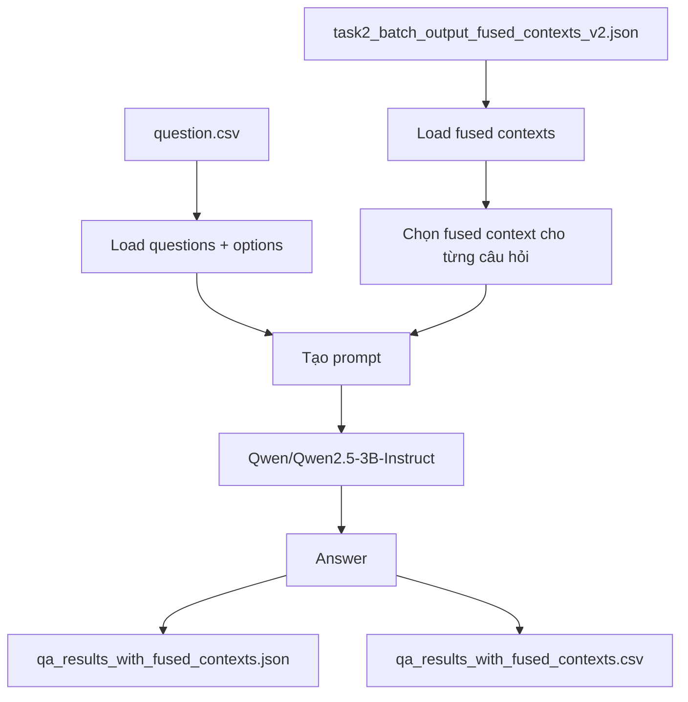
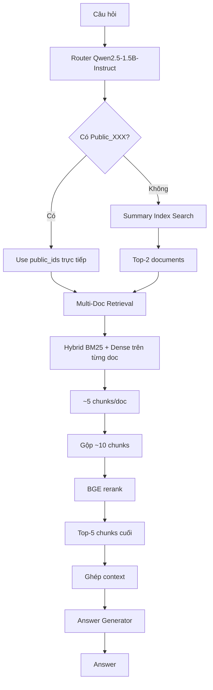
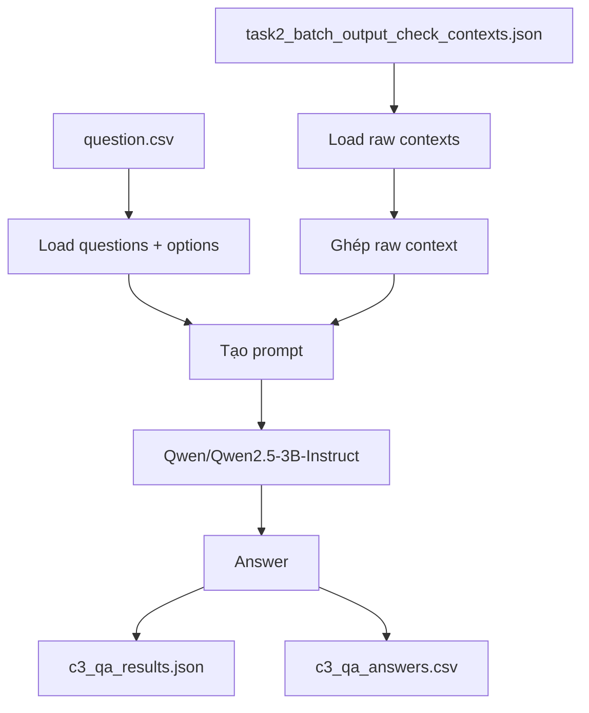

# Sơ đồ 3 Pipeline QA

Tài liệu này chỉ mô tả sơ đồ của 3 pipeline QA đang có trong workspace, không đi vào phần so sánh chi tiết.

Lưu ý quan trọng:
- Với pipeline fused context và baseline QA, code hiện tại có bước preload / cache chunk để giảm thời gian xử lý lặp lại.
- Tuy nhiên, trong triển khai thực tế, pipeline vẫn phải load hoặc đọc chunk từ nguồn dữ liệu ban đầu trước khi tạo context.
- Phần preload này chỉ giúp giảm thời gian chạy cho các lần sau, không thay thế hoàn toàn bước load dữ liệu.

## 1. Pipeline Fused Context

File chính: [run_qa_with_fused_contexts.py](run_qa_with_fused_contexts.py)

Sơ đồ:

Luồng xử lý:
1. Load fused contexts đã chuẩn bị sẵn.
2. Load câu hỏi và options.
3. Ghép `CONTEXT`, `QUESTION`, `OPTIONS`, `ANSWER` vào prompt.
4. Dùng `Qwen/Qwen2.5-3B-Instruct` sinh đáp án.
5. Lưu kết quả ra JSON và CSV.

Ghi chú về chunk/context:
- Context ở pipeline này là context đã fuse trước từ bước tiền xử lý.
- Nếu muốn chạy nhanh nhiều câu, code có thể tận dụng dữ liệu context đã lưu sẵn để tránh phải xử lý lại toàn bộ chunk mỗi lần.

## 2. Pipeline Router-Summary

File chính: [run_qa_router_summary.py](run_qa_router_summary.py)

Các module liên quan:
- [pipeline_router_summary/router.py](pipeline_router_summary/router.py)
- [pipeline_router_summary/pipeline.py](pipeline_router_summary/pipeline.py)
- [pipeline_router_summary/multi_doc_retrieval.py](pipeline_router_summary/multi_doc_retrieval.py)

Sơ đồ:

Luồng xử lý:
1. Router phân loại intent và trích xuất `public_ids`.
2. Nếu có `Public_XXX` trong câu hỏi thì dùng document đó luôn.
3. Nếu không có, pipeline search theo summary index để lấy top-2 tài liệu.
4. Từ các tài liệu này, pipeline chạy hybrid retrieval trên chunk.
5. Các chunk được gộp lại và rerank bằng BGE.
6. Top chunk cuối cùng được ghép thành `context` để đưa vào LLM.
7. Answer generator sinh đáp án theo intent.

Ghi chú về chunk/context:
- `context` ở pipeline này được tạo động từ chunk retrieval + rerank.
- Code có thể cache hoặc preload chunk map để giảm thời gian xử lý, nhưng ở mức logic pipeline vẫn phải đi qua bước load chunk từ `chunk_outputs_finals/` và build map trước khi retrieval.
- Đây là pipeline phù hợp nhất khi câu hỏi không biết trước doc nào chứa thông tin.

## 3. Baseline QA

File chính: [baseline_qa_qwen.py](baseline_qa_qwen.py)

Sơ đồ:

Luồng xử lý:
1. Load context raw đã chuẩn bị sẵn.
2. Ghép top-k chunks thành raw context.
3. Tạo prompt cố định.
4. Dùng `Qwen/Qwen2.5-3B-Instruct` sinh câu trả lời.
5. Lưu kết quả ra JSON và CSV.

Ghi chú về chunk/context:
- Dù pipeline này không có router hay rerank, nó vẫn phải lấy context từ dữ liệu chunk đã chuẩn bị sẵn.
- Phần “load chunk” trong code có thể được tối ưu để giảm thời gian chạy lặp lại, nhưng về bản chất vẫn cần nguồn context đầu vào trước khi tạo prompt.

## 4. Tóm tắt ngắn

- Fused Context: context đã fuse sẵn, LLM chỉ làm phần trả lời.
- Router-Summary: router → summary search → retrieve chunk → rerank → ghép context → trả lời.
- Baseline QA: raw context → prompt → trả lời.

Nếu cần, file này có thể được mở rộng thêm thành sơ đồ Mermaid chi tiết hơn cho từng bước nội bộ như load chunk, build chunk map, rerank score, và save output.
