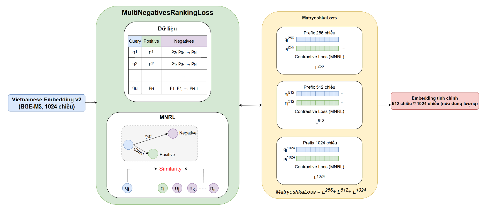
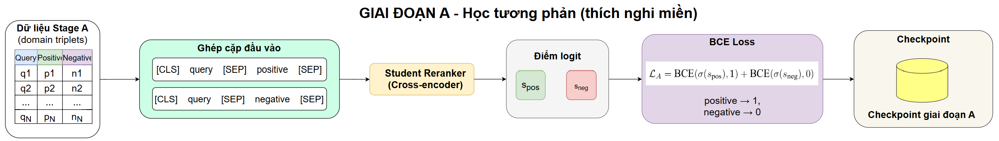
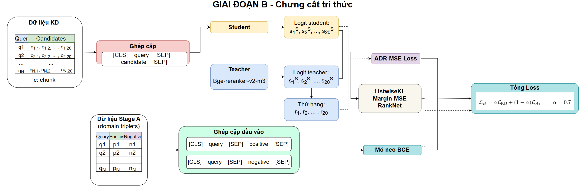
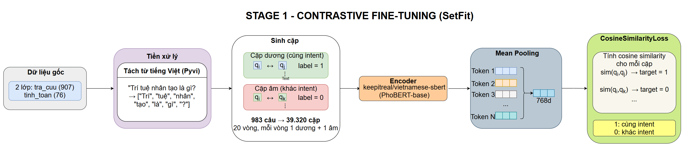
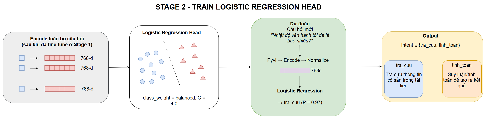

# Xây dựng hệ thống hỏi đáp tài liệu kỹ thuật tiếng Việt với tinh chỉnh embedding và chưng cất mô hình xếp hạng lại

**Sinh viên:** Trần Quang Huy — 20225201
**Trường Đại học Bách Khoa Hà Nội**

---

## 1. Tóm tắt

Đồ án xây dựng một hệ thống RAG (Retrieval-Augmented Generation) cho tài liệu kỹ thuật tiếng Việt, giải quyết ba nút thắt được đo lường thực tế từ một hệ thống nền tảng (v1):

| Nút thắt v1 | Đo lường | Giải pháp v2 |
|---|---|---|
| Embedding chưa tối ưu miền | Acc@1 = 70.77% (base 1024d) | Tinh chỉnh 512d bằng MNRL + Matryoshka Loss |
| Reranker quá nặng | 23 giây/câu trên CPU (568M) | Chưng cất + cắt tỉa từ vựng + lượng tử hoá INT8 (34.8MB) |
| Định tuyến bằng LLM lớn | 743ms/câu, phụ thuộc API | Bộ phân loại SetFit cục bộ (83–103ms, F1=0.947) |

**Kết quả cuối:** pipeline v2 nhanh hơn v1 **9.5 lần** (end-to-end) và **19.7 lần** (core pipeline không tính LLM), giữ nguyên hoặc vượt nhẹ độ chính xác, chạy hoàn toàn trên CPU không cần GPU.

---

## 2. Đặt vấn đề

LLM thuần túy gặp ba hạn chế khi trả lời câu hỏi chuyên biệt: hallucination, tri thức cố định tại thời điểm huấn luyện, và chưa thích nghi tốt với tài liệu kỹ thuật tiếng Việt của từng lĩnh vực. RAG giải quyết bằng cách truy hồi tài liệu nội bộ trước khi sinh câu trả lời — nhưng tài liệu kỹ thuật tiếng Việt có bốn đặc thù riêng mà RAG thông thường xử lý chưa tốt:

- Câu hỏi yêu cầu tra đúng một giá trị/điều kiện trong bảng biểu
- Nhiều ký hiệu, mã thiết bị, định danh tài liệu (`Public_XXX`)
- Cùng chủ đề xuất hiện ở nhiều đoạn → dễ sinh false negative khi truy hồi
- Ràng buộc độ trễ và chi phí khi triển khai trên CPU / nội bộ

**Bối cảnh dữ liệu:** Viettel AI Race 2025 — 991 câu hỏi trắc nghiệm tiếng Việt, 200 tài liệu kỹ thuật đa lĩnh vực (phần mềm kiểm thử, thiết bị y tế, ô tô, điện, HVAC...).

---

## 3. Phương pháp luận: hai giai đoạn

**Giai đoạn 1 — Xây dựng và đánh giá v1:** dựng hai pipeline (Baseline Router, Router-Summary) theo kiến trúc RAG chuẩn — hybrid retrieval (BM25 + dense) → cross-encoder rerank → LLM sinh câu trả lời — để đo độ chính xác, độ trễ, và lỗi thực tế.

**Giai đoạn 2 — Tối ưu v2:** dựa trên đúng ba nút thắt đã đo ở v1, tối ưu từng thành phần với số liệu dẫn dắt, không tối ưu theo giả định.

### Kiến trúc tổng thể

```
OFFLINE:  PDF → tiền xử lý/chia đoạn → Corpus
                        ↓
          Quy trình dữ liệu huấn luyện dùng chung
                        ↓
    ┌───────────────┬──────────────────┬─────────────────┐
    ↓               ↓                  ↓
Tinh chỉnh      Chưng cất          Phân loại
embedding       reranker           intent (SetFit)
(MNRL+MRL)      (2 giai đoạn,
                cắt tỉa, INT8)

ONLINE:   Câu hỏi → Router (intent) → Truy hồi lai (BM25+dense, RRF)
                  → Reranker (nén) → LLM sinh câu trả lời theo intent
```

---

## 4. Ba đóng góp chính

### 4.1. Embedding — tinh chỉnh theo miền với Matryoshka



**Dữ liệu:** từ 991 câu hỏi gốc, truy hồi lai + BGE-reranker-v2-m3 lấy top-20 ứng viên, một **LLM đóng vai giám khảo** phân loại từng ứng viên (liên quan trực tiếp / một phần / không liên quan) — một câu hỏi có thể có nhiều positive. Sau lọc còn **792 câu hợp lệ** → chia 80/20 → **D1** (158 câu test in-domain).

**Huấn luyện:** `MultipleNegativesRankingLoss` (mỗi câu hỏi phân biệt positive của nó với toàn bộ positive của các câu khác trong batch, làm in-batch negative), bọc trong `MatryoshkaLoss` — tối ưu đồng thời 256/512/1024 chiều trong một lần train. Với câu hỏi có nhiều positive, **resample ngẫu nhiên mỗi epoch** thay vì cố định một positive.

**Kết quả (D2, 390 câu, 50 tài liệu hoàn toàn mới):**

| Cấu hình | Dim | Acc@1 | MRR@10 |
|---|---|---|---|
| Base (chưa fine-tune) | 1024 | 70.77% | 0.7951 |
| **Fine-tuned** | **512** | **71.79% ± 0.42** | **0.7982 ± 0.0017** |
| Fine-tuned | 1024 | 71.45% ± 0.12 | 0.8059 ± 0.0002 |

512 chiều đạt chất lượng gần tương đương 1024 chiều → giảm 50% dung lượng lưu trữ vector mà không đánh đổi chất lượng đáng kể.

### 4.2. Reranker — chưng cất + cắt tỉa + lượng tử hoá

<p align="center">
  
  
</p>

**Dữ liệu:** kế thừa từ quy trình embedding. Khai thác negative từ ứng viên hạng 6–20, phân loại độ khó theo chênh lệch điểm teacher (khó: 0.1–0.4, trung bình: 0.4–0.7) → **9.917 negative**, chia 90/10 theo câu hỏi → 2.328 bộ ba train, 305 dev.

**Huấn luyện hai giai đoạn:**
- **Giai đoạn A** — học tương phản: BCE trên bộ ba domain, thích nghi miền
- **Giai đoạn B** — chưng cất tri thức: cả teacher (BGE-reranker-v2-m3) và student cùng chấm 20 ứng viên; loss tổng hợp $L = \alpha L_{KD} + (1-\alpha)L_A$, α=0.7 — 4 lựa chọn cho $L_{KD}$ (ListwiseKL, Margin-MSE, RankNet, **ADR-MSE**) được so sánh, ADR-MSE thắng trên backbone triển khai (H384)

**Cắt tỉa từ vựng:** mmarco kế thừa vocab XLM-R (250.002 token cho 100 ngôn ngữ, >80% tham số). Giữ token thực dùng trong corpus + 30.000 token phổ biến dự phòng → **36.324 token**, giảm **69.7% tham số** (117.6M → 35.6M), UNK rate = 0.225%.

**Lượng tử hoá:** INT8 động qua ONNX Runtime → **34.8MB** (giảm 74% so với FP32).

**Kết quả (D2, 390 câu):**

| Model | Params | MRR@10 |
|---|---|---|
| BGE-reranker-v2-m3 (teacher) | 568M | 0.8862 |
| **mmarco H384 (chưng cất)** | **117M** | **0.8865** |
| **Pruned H384 + INT8 (triển khai)** | **35.6M / 34.8MB** | **0.8834–0.8844** |
| ViRanker (SOTA tiếng Việt) | 568M | 0.8593 |

Student 35.6M đạt chất lượng ngang teacher 568M, vượt SOTA tiếng Việt công khai dù nhỏ hơn 16 lần, chạy được hoàn toàn trên CPU (~1.07 giây/câu, so với 11.2 giây của teacher).

**Ablation quan trọng đã thực hiện:**
- 4 hàm loss chưng cất, so sánh trên 2 backbone (MiniLM, H384)
- Vai trò giai đoạn A: chứng minh bị "quên" (catastrophic forgetting) khi huấn luyện tuần tự; nhánh mỏ neo chạy song song trong giai đoạn B hiệu quả hơn ~12 lần
- Khảo sát α (0.3/0.5/0.7/1.0): đỉnh tại 0.7, trade-off Recall↔Precision
- Cắt tầng (L12→L6): **thất bại hoàn toàn** (MRR 0.716, do phá vỡ residual stream) — bài học quan trọng
- Phân tích tokenizer MiniLM: mất dấu tiếng Việt, 36.8% vốn từ bị gộp đồng âm giả

### 4.3. Bộ phân loại ý định — SetFit cục bộ thay GPT router

<p align="center">
  
  
</p>

**Huấn luyện 2 giai đoạn (SetFit-style):**
- Giai đoạn 1: tinh chỉnh Sentence-BERT tiếng Việt (`vietnamese-sbert`, nền PhoBERT) bằng `CosineSimilarityLoss` trên cặp câu (cùng/khác ý định); 983 câu → sinh 39.320 cặp qua 20 vòng lặp
- Giai đoạn 2: gắn `LogisticRegression` (`class_weight=balanced`, C=4.0) lên embedding đã tinh chỉnh, không train lại encoder

**Kết quả:**

| Metric | GPT-4o-mini router (v1) | SetFit router (v2) |
|---|---|---|
| Độ chính xác định tuyến | 94.62% | **97.69%** |
| Độ trễ/câu | 743.0ms (API) | **83–103.5ms (cục bộ)** |
| Chi phí | Phụ thuộc API | **$0** |

---

## 5. Đánh giá end-to-end

Trên 390 câu hỏi trắc nghiệm: v1 và v2 đạt **cùng số câu đúng (380/390, 97.44%)**.

| Thành phần | v1 | v2 | v2 (INT8) | Speedup v1→INT8 |
|---|---|---|---|---|
| Routing | 743.0ms | 103.5ms | 83.4ms | 8.9× |
| Rerank | 23.166.6ms | 2.002.0ms | 1.105.7ms | 21.0× |
| **Core pipeline (không LLM)** | 23.931.5ms | 2.137.6ms | **1.214.9ms** | **19.7×** |
| Sinh câu trả lời (LLM) | 1.966.2ms | — | 1.498.6ms | 1.3× |
| **Tổng** | **25.897.8ms** | — | **2.713.6ms** | **9.5×** |

**Kiểm chứng độc lập (71 câu, chưa từng dùng để tuning):** v2 đạt 67/71 (94.37%) so với v1 66/71 (92.96%) — kết luận nhất quán với tập 390 câu, xác nhận cải thiện là thực chất, không phải hiệu ứng lựa chọn cấu hình.

---

## 6. Hạn chế

- Cải thiện embedding trên D2 (tài liệu chưa từng thấy) còn khiêm tốn (+1.02 điểm Acc@1) do base model đã mạnh sẵn và dữ liệu miền nhỏ (634 câu train)
- Cắt tỉa từ vựng giảm 70% dung lượng nhưng không giảm độ trễ — chi phí tính toán nằm ở tầng transformer, không phải bảng embedding
- Chỉ đánh giá trên một miền tài liệu kỹ thuật cụ thể (Viettel AI Race 2025), chưa kiểm chứng khả năng tổng quát hoá sang miền khác
- Chưa xử lý false negative trong in-batch negative sampling của MNRL (được ghi nhận là khoảng trống nghiên cứu, literature có đề xuất GISTEmbedLoss)

## 7. Hướng phát triển

- Mở rộng bộ kiểm thử với xác minh thủ công hoàn toàn và bổ sung hard negative đặc thù miền
- Khảo sát thêm kỹ thuật nén (chưng cất theo tầng đúng cách, lượng tử hoá tĩnh) và kiến trúc thay thế (late interaction, PreTTR) để giảm độ trễ hơn nữa mà không cần GPU
- Đánh giá trên nhiều miền tài liệu và môi trường vận hành thực tế khác

---

## 8. Tóm tắt số liệu chủ chốt

| Chỉ số | Giá trị |
|---|---|
| Embedding: Acc@1 (512d, D2) | 71.79% (vs base 70.77%) |
| Reranker: MRR@10 (pruned+INT8, D2) | 0.8834 (vs teacher 0.8862) |
| Reranker: dung lượng | 34.8MB (vs teacher 2.2GB, nhỏ hơn 62×) |
| Router: độ chính xác | 97.69% (vs GPT 94.62%) |
| Router: độ trễ | 83–103.5ms (vs GPT 743ms) |
| End-to-end: tốc độ core pipeline | nhanh hơn 19.7× |
| End-to-end: tốc độ tổng | nhanh hơn 9.5× |
| End-to-end: độ chính xác | không đổi (380/390, 97.44%) |

---

*README này được tổng hợp lại từ toàn bộ nội dung luận văn (Chương 1–5) phục vụ mục đích tra cứu nhanh và chuẩn bị bảo vệ.*
