# **VIETTEL AI RACE** TD048

# **NHẬN DIỆN VỊ TRÍ BIỂN SỐ XE MÁY VIỆT NAM** Lần ban hành: 1

# **1. Lời mở đầu**

Bài toán nhận diện biển số xe Việt Nam là một bài toán không còn mới, đã được phát triển dựa trên các phương pháp xử lý ảnh truyền thống và cả những kỹ thuật mới sử dụng Deep Learning. Trong bài toán này tôi chỉ phát triển bài toán phát hiện biển số (một phần trong bài toán nhận diện biển số) dựa trên thuật toán YOLO-Tinyv4 với mục đích:

- Hướng dẫn chuẩn bị dữ liệu cho bài toán Object Detection.
- Hướng dẫn huấn luyện YOLO-TinyV4 dùng darknet trên Google Colab.

# **2. Chuẩn bị dữ liệu**

### **2.1 Đánh giá bộ dữ liệu**

Trong bài viết tôi sử dụng bộ dữ liệu biển số xe máy Việt Nam chứa 1750 ảnh, bạn đọc có thể tải tại [đây](https://thigiacmaytinh.com/tai-nguyen-xu-ly-anh/tong-hop-data-xu-ly-anh/?fbclid=IwAR2tajA5Ku83kIrb09ovhmb_68Zmdwo9KvV_CSNBCTbuIIsiK_FUM4W4Dh8).

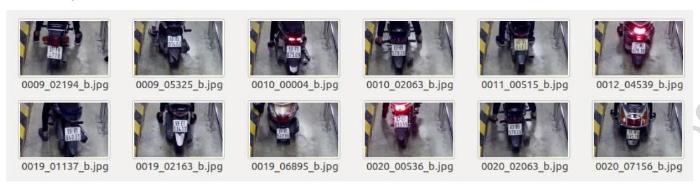

Hình 14.1: Ảnh biển số trong bộ dữ liệu

Ảnh biển số xe được trong bộ dữ liệu được chụp từ một camera tại vị trí kiểm soát xe ra vào trong hầm. Do vậy:

- Kích thước các biển số xe không có sự đa dạng, do khoảng cách từ camera đến biển số xe xấp xỉ gần bằng nhau giữa các ảnh.
- Ảnh có độ sáng thấp và gần giống nhau do ảnh được chụp trong hầm chung cư.
- => Cần làm đa dạng bộ dữ liệu.

# **2.2 Các phương pháp tăng sự đa dạng của bộ dữ liệu**

# **Đa dạng kích thước của biển số**

Đa dạng kích thước bằng 2 cách:

- Cách 1: Thu nhỏ kích thước biển bằng cách thêm biên kích thước ngẫu nhiên vào ảnh gốc, sau đó resize ảnh bằng kích thước ảnh ban đầu.
- Cách 2: Crop ảnh chứa biển số với kích thước ngẫu nhiên, sau đó resize ảnh bằng kích thước ảnh ban đầu.

*# Cách1* def add\_boder(image\_path, output\_path, low, high):

*""" low: kích thước biên thấp nhất (pixel) hight: kích thước biên lớn nhất (pixel)*

*"""*

*# random các kích thước biên trong khoảng (low, high)* 

#### **VIETTEL AI RACE** TD048

#### **NHẬN DIỆN VỊ TRÍ BIỂN SỐ XE MÁY VIỆT NAM** Lần ban hành: 1

top = random.randint(low, high)

bottom = random.randint(low, high)

left = random.randint(low, high)

right = random.randint(low, high)

image = cv2.imread(image\_path)

original\_width, original\_height = image.shape[1], image.shape[0]

*#sử dụng hàm của opencv để thêm biên* 

image = cv2.copyMakeBorder(image, top, bottom, left, right, cv2.BORDER\_REPLICATE)

*#sau đó resize ảnh bằng kích thước ban đầu của ảnh* 

image = cv2.resize(image, (original\_width, original\_height))

cv2.imwrite(output\_path, image)

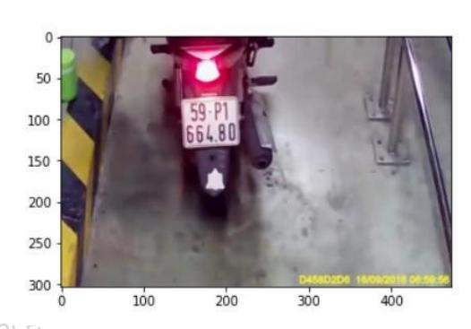

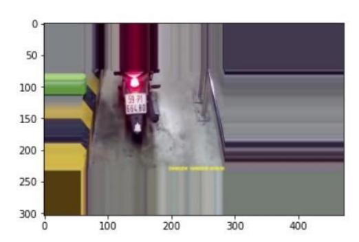

Hình 14.2: Ảnh thu được (bên phải) sau khi chạy hàm trên

*# Cách2* def random\_crop(image\_path, out\_path):

image = cv2.imread(image\_path)

original\_width, original\_height = image.shape[1], image.shape[0]

x\_center,y\_center = original\_height//2, original\_width//2

x\_left = random.randint(0, x\_center//2)

x\_right = random.randint(original\_width-x\_center//2, original\_width)

y\_top = random.randint(0, y\_center//2)

y\_bottom = random.randint(original\_height-y\_center//2, original\_width)

*# crop ra vùng ảnh với kích thước ngẫu nhiên* 

cropped\_image = image[y\_top:y\_bottom, x\_left:x\_right]

*# resize ảnh bằng kích thước ảnh ban đầu* 

cropped\_image = cv2.resize(cropped\_image, (original\_width, original\_height))

cv2.imwrite(out\_path, cropped\_image)

# **NHẬN DIỆN VỊ TRÍ BIỂN SỐ XE MÁY VIỆT NAM** Lần ban hành: 1

**VIETTEL AI RACE** TD048

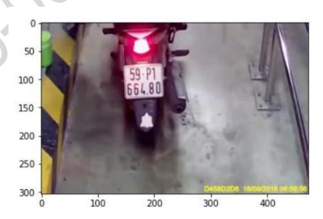

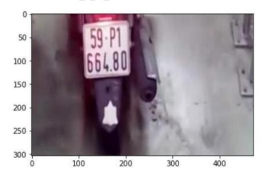

Hình 14.3: Ảnh thu được (bên phải) sau khi chạy hàm trên

# **Thay đổi độ sáng của ảnh**

def change\_brightness(image\_path, output\_path, value):

*""" value: độ sáng thay đổi"""* 

img=cv2.imread(image\_path)

hsv = cv2.cvtColor(img, cv2.COLOR\_BGR2HSV)

h, s, v = cv2.split(hsv)

v = cv2.add(v, value)

v[v > 255] = 255

v[v < 0] = 0

final\_hsv = cv2.merge((h, s, v))

img = cv2.cvtColor(final\_hsv, cv2.COLOR\_HSV2BGR)

cv2.imwrite(output\_path, img)

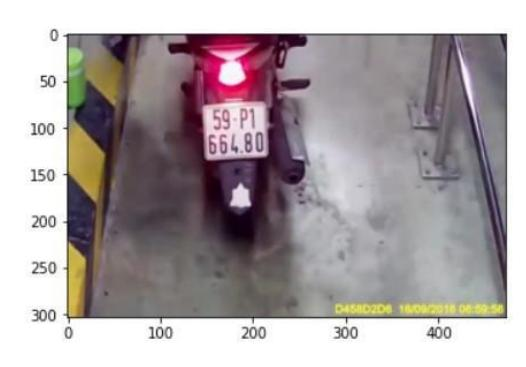

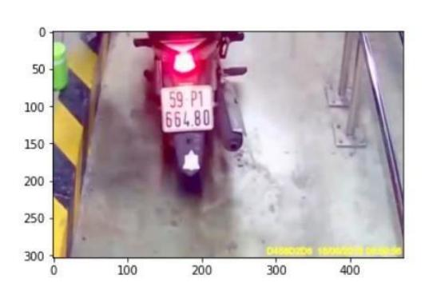

Hình 14.4: Độ sáng thay đổi (bên phải)

#### **Xoay ảnh**

import imutils def rotate\_image(image\_path, range\_angle, output\_path):

*""" range\_angle: Khoảng góc quay"""* 

image = cv2.imread(image\_path)

*#lựa chọn ngẫu nhiên góc quay* 

# **VIETTEL AI RACE** TD048 **NHẬN DIỆN VỊ TRÍ BIỂN SỐ XE MÁY VIỆT NAM** Lần ban hành: 1

angle = random.randint(-range\_angle, range\_angle)

img\_rot = imutils.rotate(image, angle)

cv2.imwrite(output\_path, img\_rot)

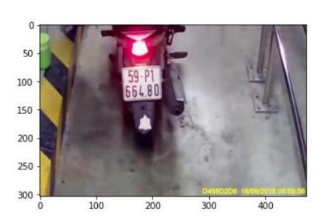

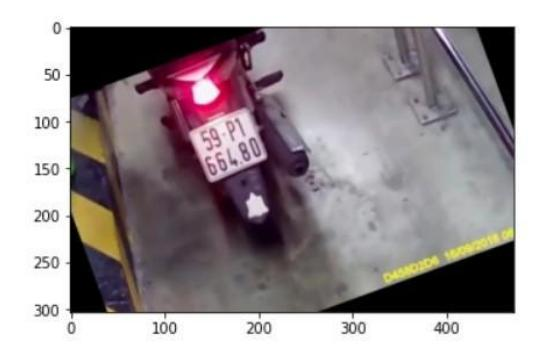

Hình 14.5: Ảnh được xoay (bên phải)

# **2.3 Gán nhãn dữ liệu**

Tool gán nhãn ở đây tôi dùng là **labelImg**, bạn đọc có thể tải và đọc hướng dẫn sử dụng tạ[i đây](https://github.com/tzutalin/labelImg).

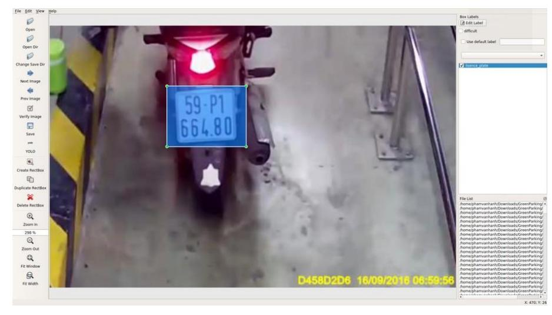

Hình 14.6: Xác định vùng biển chứa biển số

**LabelImg** hỗ trợ gán nhãn trên cả 2 định dạng PASCAL VOC và YOLO với phần mở rộng file annotation tương ứng là .xml và .txt.

Trong bài toán sử dụng mô hình YOLO, tôi lưu file annotation dưới dạng .txt.

Hình 14.7: Nội dung trong một file annotation

Mỗi dòng trong một file annotation bao gồm: <object-class> <x> <y> <width> <height>.

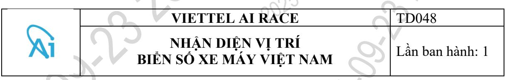

Trong đó: <x> <y> <width> <height> tương ứng là tọa độ trung tâm và kích thước của đối tượng. Các giá trị này đã được chuẩn hóa lại, do vậy giá trị luôn nằm trong đoạn [0,1]. objectclass là chỉ số đánh dấu các classes.

Lưu ý: Với bài toán có nhiều nhãn, nhiều người cùng gán nhãn thì cần thống nhất với nhau trước về thứ tự nhãn. Nguyên nhân do trong file annotation chỉ lưu chỉ số (0,1,3,4,...) của nhãn chứ không lưu tên nhãn.

Sau khi gán nhãn xong các bạn để file annotation và ảnh tương ứng **vào cùng một thư mục**.

# **3. Huấn luyện mô hình**

# **3.1 Giới thiệu về YOLO-Tinyv4 và darknet**

### **YOLO-Tinyv4**

YOLOv4 là thuật toán Object Detection, mới được công bố trong thời gian gần đây với sự cải thiện về kết quả đáng kể so với YOLOv3.

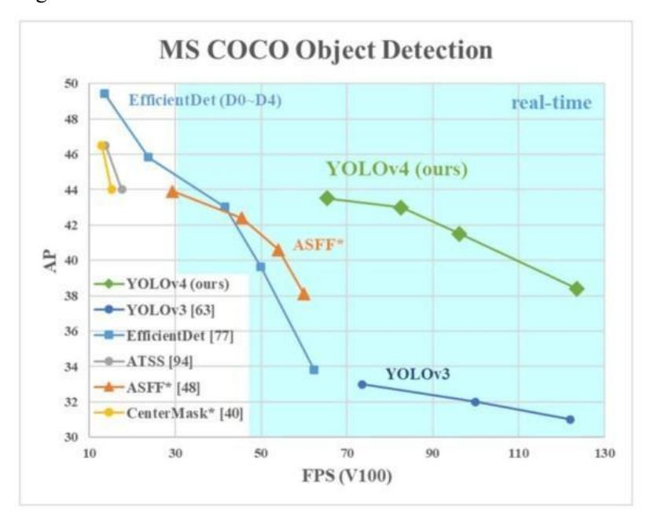

Hình 14.8: Sự cải thiện của YOLOv4 ([source\)](https://arxiv.org/pdf/2004.10934.pdf)

YOLOv4 cho kết quả real-time khi chạy trên các nền tảng GPU cao cấp. Với mục đích tradeoff giữa độ chính xác và tốc độ để có thể chạy trên các nền tảng CPU và GPU thấp hơn thì YOLO-Tinyv4 được ra đời.

#### **VIETTEL AI RACE** TD048

# **NHẬN DIỆN VỊ TRÍ BIỂN SỐ XE MÁY VIỆT NAM** Lần ban hành: 1

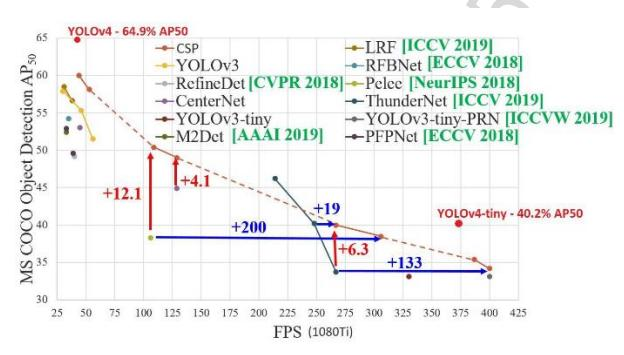

Hình 14.9: YOLOv4 với YOLO-Tinyv4 [\(source\)](https://github.com/AlexeyAB/darknet/issues/6067)

Hình 14.10: YOLO-Tinyv4 trên các nền tảng ([source\)](https://github.com/AlexeyAB/darknet/issues/6067)

#### **Darknet**

**[Darknet](https://pjreddie.com/darknet/)** là một framework open source chuyên về Object Detection được viết bằng ngôn ngữ C và CUDA. Darknet dùng để huấn luyện các mô hình YOLO một cách nhanh chóng, dễ sử dụng.