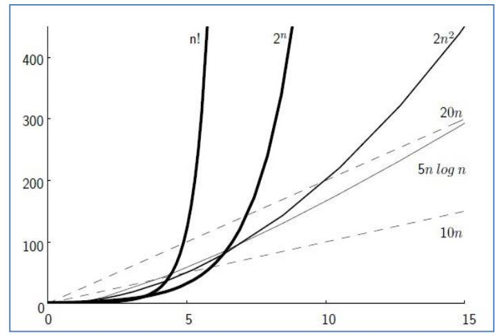

#### **VIETTEL AI RACE** TD050 **GIỚI THIỆU - ĐỘ PHỨC TẠP THUẬT TOÁN** <sup>L</sup>ần ban hành: 1

#### **1. Khái niệm độ phức tạp thuật toán**

Thời gian thực hiện một giải thuật bằng chương trình máy tính phụ thuộc vào các yếu tố:

- Kích thước dữ liệu đầu vào: một giải thuật hay một chương trình máy tính thực hiện trên tập dữ liệu có kích thước lớn hiển nhiên mất nhiều thời gian hơn thuật toán hoặc chương trình này thực hiện trên tập dữ liệu đầu vào có kích thước nhỏ.
- Phần cứng của hệ thống máy tính: hệ thống máy tính có tốc độ cao thực hiện nhanh hơn trên hệ thống máy tính có tốc độ thấp.

Tuy nhiên, nếu ta quan niệm thời gian thực hiện của một thuật toán là số các phép toán sơ cấp thực hiện trong thuật toán đó thì phần cứng máy tính không còn là yếu tố ảnh hưởng đến quá trình xác định thời gian thực hiện của một thuật toán. Với quan niệm này, độ phức tạp thời gian thực hiện của một thuật toán chỉ còn phụ thuộc duy nhất vào độ dài dữ liệu đầu vào.

Gọi độ dài dữ liệu đầu vào là *T*(*n*). Khi đó, số lượng các phép toán sơ cấp để giải bài toán *P* thực hiện theo thuật toán *F*=*F*1*F*2..*F*<sup>n</sup> trên độ dài dữ liệu *T*(*n*) là *F*(*T*(*n*)). Để xác định số lượng các phép toán sơ cấp *F*<sup>i</sup> (*i*=*1*, *2*, .., *n*) thực hiện trong thuật toán *F* ta cần phải giải bài toán đếm để xác định *F*(*T*(*n*)). Đây là bài toán vô cùng khó và không phải lúc nào cũng giải được []. Để đơn giản điều này, người ta thường tìm đến các phương pháp xấp xỉ để tính toán độ phức tạp thời gian của một thuật toán. Điều này có nghĩa, khi ta không thể xây dựng được công thức đếm *F*(*T*(*n*)), nhưng ta lại có khẳng định chắc chắn *F*(*T*(*n*)) không vượt quá một phiếm hàm biết trước *G*(*n*) thì ta nói *F*(*T*(*n*)) thực hiện nhanh nhất là *G*(*n*).

**Tổng quát**, *cho hai hàm f*(*x*)*, g*(*x*) *xác định trên tập các số nguyên dương hoặc tập các số thực. Hàm f*(*x*) *được gọi là O*(*g*(*x*)) *nếu tồn tại một hằng số C>0 và n<sup>0</sup> sao cho:*

$$|f(x)| \le C.|g(x)|$$
 với mọi  $x \ge n_0$ .

Điều này có nghĩa với các giá trị *x* ≥*n*<sup>0</sup> hàm *f*(*x*) bị chặn trên bởi hằng số *C* nhân với *g*(*x*). Nếu *f*(*x*) là thời gian thực hiện của một thuật toán thì ta nói giải thuật đó có cấp *g*(*x*) hay độ phức tạp thuật toán *f*(*x*) là *O*(*g*(*x*)).

**Ghi chú**. Các hằng số *C*, *n*<sup>0</sup> thỏa mãn điều kiện trên là không duy nhất. Nếu có đồng thời *f*(*x*) là *O*(*g*(*x*)) và *h*(*x*) thỏa mãn *g*(*x*) < *h*(*x*) với *x*>*n*<sup>0</sup> thì ta cũng có *f*(*x*) là *O*(*h*(*n*)).

**Ví dụ 1.6**. Cho () = + −1−1 + ⋯ + 1 + 0; trong đó, *a*<sup>i</sup> là các số thực (i =0,1, 2, ..,n). Khi đó *f*(*x*) = *O*(*x* n ).

**Chứng minh**. Thực vậy, với mọi *x*>*1* ta có:

## **GIỚI THIỆU - ĐỘ PHỨC TẠP THUẬT**

**TOÁN** <sup>L</sup>ần ban hành: 1

$$|f(x)| = |a_n x^n + a_{n-1} x^{n-1} + \dots + a_1 x + a_0|$$

$$\leq |a_n| x^n + |a_{n-1}| x^{n-1} + \dots + |a_1| x + |a_0|$$

$$\leq |a_n| x^n + |a_{n-1}| x^n + \dots + |a_1| x^n + |a_0| x^n$$

$$\leq x^n (|a_n| + |a_{n-1}| + \dots + |a_{1|}| + |a_{0|})$$

$$\leq C. \ x^n = O(x^n) \ . \ \text{Trong $d\'o, $C = (|a_n| + |a_{n-1}| + \dots + |a_{1|}| + |a_{0|}).}$$

### **2. Một số quy tắc xác định độ phức tạp thuật toán**

Như đã đề cập ở trên, bản chất của việc xác định độ phức tạp thuật toán là giải bài toán đếm số lượng các phép toán sơ cấp thực hiện trong thuật toán đó. Do vậy, tất cả các phương pháp giải bài toán đếm thông thường đều được áp dụng trong khi xác định độ phức tạp thuật toán. Hai nguyên lý cơ bản để giải bài toán đếm là nguyên lý cộng và nguyên lý nhân cũng được mở rộng trong khi ước lượng độ phức tạp thuật toán.

**Nguyên tắc tổng:** Nếu *f*1(*x*) có độ phức tạp là O(*g*1(*x*)) và *f*2(*x*) có độ phức tạp là O(*g*2(*x*)) thì độ phức tạp của (*f*1(*x*) + f2(*x*) là O( *Max*(*g*1(*x*), *g*2(*x*)).

**Chứng minh**. Vì *f*1(*x*) có độ phức tạp là O(*g*1(*x*) nên tồn tại hằng số *C*<sup>1</sup> và *k*<sup>1</sup> sao cho |*f*1(*x*)| |*g*1(*x*)| với mọi *x k*1. Vì *f*2(*x*) có độ phức tạp là O(*g*2(*x*)) nên tồn tại hằng số *C*<sup>2</sup> và *k*<sup>2</sup> sao cho |*f*2(*x*)| |*g*2(*x*)| với mọi *x k*2.

Ta lại có :

$$|f_1(x)+f_2(x)| \cdot |f_1(x)| + |f_2(x)|$$
  
  $\cdot C_1|g_1(x)| + C_2|g_2(x)|$   
  $\cdot C|g(x)|$  với mọi  $x > k$ ;

Trong đó, *C* = *C*<sup>1</sup> + *C*2; *g*(*x*) = *max*( *g*1(*x*), *g*2(*x*)); *k* = *max* (*k*1, *k*2).

**Tổng quát**. Nếu độ phức tạp của *f*1(*x*), *f*2(*x*),.., *f*m(*x*) lần lượt là O(*g*1(*x*)), O(*g*2(*x*)),.., O(*g*n(*x*)) thì độ phức tạp của *f*1(*x*) + *f*2(*x*) + ..+*f*m(*x*) là O(*max*(*g*1(*x*), *g*2(*x*),..,*g*m(*x*)).

**Nguyên tắc nhân:** Nếu *f*(*x*) có độ phức tạp là O(*g*(*x*) thì độ phức tạp của *f* n (*x*) là O(*g* n (*x*)). Trong đó:

$$f^{n}(x) = f(x).f(x)....f(x). //n \quad lan \quad f(x).$$

$$g^{n}(x) = g(x).g(x)...g(x).//n \quad lan \quad g(x)$$

### **VIETTEL AI RACE** TD050 **GIỚI THIỆU - ĐỘ PHỨC TẠP THUẬT**

**TOÁN** <sup>L</sup>ần ban hành: 1

**Chứng minh**. Thật vậy theo giả thiết *f*(*x*) là O(*g*(*x*)) nên tồn tại hằng số *C* và *k* sao cho với mọi *x*>*k* thì |*f*(*x*)| C.|*g*(*x*). Ta có:

$$|f^{n}(x)| = |f^{1}(x). f^{2}(x) \dots f^{n}(x)|$$

$$\leq |C. g^{1}(x). C. g^{2}(x) \dots C. g^{n}(x)|$$

$$\leq |C^{n}. g^{n}(x)| = O(g^{n}(x))$$

### **3. Một số dạng hàm được dùng xác định độ phức tạp thuật toán**

Như đã đề cập ở trên, để xác định chính xác độ phức tạp thuật toán f(x) là bài toán khó nên ta thường xấp xỉ độ phức tạp thuật toán với một phiếm hàm O(g(x)). Dưới đây là một số phiếm hàm của O(g(x)).

| Dạng phiếm hàm  | Tên gọi                |
|-----------------|------------------------|
| O(1)            | Hằng số                |
| O( log(log(n))) | Logarit của logarit    |
| O (log(n))      | Logarithm              |
| O(n)            | Tuyến tính             |
| O(n2<br>)       | Bậc 2                  |
| O(n3<br>)       | Bậc 3                  |
| O(nm<br>)       | Đa thức (m là hằng số) |
| O(mn<br>)       | Hàm mũ                 |
| O(n!)           | Giai thừa              |

**Bảng 1.1. Các dạng hàm xác định độ phức tạp thuật toán** 



### **GIỚI THIỆU - ĐỘ PHỨC TẠP THUẬT TOÁN** <sup>L</sup>ần ban hành: 1

**Hình 1.1**. *Độ tăng của các hàm theo độ dài dữ liệu*

Dưới đây là một số qui tắc xác định O(g(x)):

- Nếu một thuật toán có độ phức tạp hằng số thì thời gian thực hiện thuật toán đó không phụ thuộc vào độ dài dữ liệu.
- Một thuật toán có độ phức tạp logarit của f(n) thì ta viết O(log(n)) mà không cần chỉ rõ cơ số của phép logarit.
- Với P(n) là một đa thức bậc k thì O(P(n)) = O(n<sup>k</sup> ).
- Thuật toán có độ phức tạp đa thức hoặc nhỏ hơn được xem là những thuật toán thực tế có thể thực hiện được bằng máy tính. Các thuật toán có độ phức tạp hàm mũ, hàm giai thừa được xem là những thuật toán thực tế không giải được bằng máy tính.

### **4. Độ phức tạp của các cấu trúc lệnh**

 Để đánh giá độ phức tạp của một thuật toán đã được mã hóa thành chương trình máy tính ta thực hiện theo một số qui tắc sau.

**Độ phức tạp hằng số O(1):** đoạn chương trình không chứa vòng lặp hoặc lời gọi đệ qui có tham biến là một hằng số.

 **Ví dụ 1.7**. Đoạn chương trình dưới đây có độ phức tạp hằng số.

```
for (i=1; i<=c; i++) { 
 <Tập các chỉ thị có độ phức tạp O(1)>; 
 }
```

**Độ phức tạp O(n)**: Độ phức tạp của hàm hoặc đoạn code là O(n) nếu biến trong vòng lặp tăng hoặc giảm bởi mộ hằng số c.

 **Ví dụ 1.8**. Đoạn code dưới đây có độ phức tạp hằng số.

```
for (i=1; i<=n; i = i + c ) { 
 <Tập các chỉ thị có độ phức tạp O(1)>; 
 } 
 for (i=n; i>0; i = i - c ){ 
 <Tập các chỉ thị có độ phức tạp O(1)>; 
 }
```

**Độ phức tạp đa thức O(n**<sup>c</sup> **):** Độ phức tạp của *c* vòng lặp lồng nhau, mỗi vòng lặp đều có độ phức tạp O(n) là **O(n**<sup>c</sup> **).**

 **Ví dụ 1.9**. Đoạn code dưới đây có độ phức tạp O(n<sup>2</sup> ).

### **GIỚI THIỆU - ĐỘ PHỨC TẠP THUẬT TOÁN** <sup>L</sup>ần ban hành: 1

```
 for (i=1; i<=n; i = i + c ) { 
         for (j=1; j<=n; j = j + c){ 
 <Tập các chỉ thị có độ phức tạp O(1)>; 
 } 
 } 
 for (i = n; i >0 ; i = i - c ) { 
         for (j = i- 1; j>1; j = j -c ){ 
 <Tập các chỉ thị có độ phức tạp O(1)>; 
 } 
    }
```

**Độ phức tạp logarit O(Log(n))**: Độ phức tạp của vòng lặp là log(n) nếu biểu thức khởi đầu lại của vòng lặp được chia hoặc nhân với một hằng số c.

```
 Ví dụ 1.10. Đoạn code dưới đây có độ phức tạp Log(n). 
     for (i=1; i <=n; i = i *c ){ 
 <Tập các chỉ thị có độ phức tạp O(1)>; 
 } 
 for (j=n; j >0 ; j = j / c ){ 
 <Tập các chỉ thị có độ phức tạp O(1)>; 
 }
```

**Độ phức tạp hằng số O(Log (Log(n))):** nếu biểu thức khởi đầu lại của vòng lặp được nhân hoặc chia cho một hàm mũ.

```
 Ví dụ 1.11. Đoạn code dưới đây có độ phức tạp Log Log(n). 
     for (i=1; j<=n; j*= Pow(i, c) ){ 
 <Tập các chỉ thị có độ phức tạp O(1)>; 
 } 
 for (j=n; j>=0; j = j- Function(j) ){ //Function(j) =sqrt(j) hoặc lớn hơn 2. 
 <Tập các chỉ thị có độ phức tạp O(1)>; 
 }
```

**Độ phức tạp của chương trình**: độ phức tạp của một chương trình bằng số lần thực hiện một chỉ thị tích cực trong chương trình đó. Trong đó, một chỉ thị được gọi là tích cực trong chương trình nếu chỉ thị đó phụ thuộc vào độ dài dữ liệu và thực hiện không ít hơn bất kỳ một chỉ thị nào khác trong chương trình.

```
 Ví dụ 1.12. Tìm độ phức tạp thuật toán sắp xếp kiểu Bubble-Sort? 
      Void Bubble-Sort ( int A[], int n ) {
```

### **GIỚI THIỆU - ĐỘ PHỨC TẠP THUẬT TOÁN** <sup>L</sup>ần ban hành: 1

```
for ( i=1; i<n; i++) { for ( j = i+1; j<=n; j++){ 
                if (A[i] > A[j]) {//đây chính là chỉ thị tích cực 
                    t = A[i]; A[i] = A[j]; A[j] = t; 
 } 
 } 
 } 
 }
```

**Lời giả**i. Sử dụng trực tiếp nguyên lý cộng ta có:

- Với i =1 ta cần sử dụng n-1 phép so sánh A[i] với A[j];
- Với i = 2 ta cần sử dụng n-2 phép so sánh A[i] với A[j];
- . . . . .
- Với i = n-1 ta cần sử dụng 1 phép so sánh A[i] với A[j]; Vì vậy tổng số các phép toán cần thực hiện là:

$$S = (n-1) + (n-2) + ... + 2 + 1 = n(n-1)/2 \cdot n^2 = O(n^2).$$

**Ghi chú**. Độ phức tạp thuật toán cũng là số lần thực hiện phép toán tích cực. Phép toán tích cực là phép toán thực hiện nhiều nhất đối với thuật toán.

### **5. Quy trình giải quyết bài toán trên máy tính**

 Để giải quyết một bài toán hoặc vấn đề trong tin học ta thực hiện thông qua 6 bước như sau:

- **Bước 1. Xác định yêu cầu bài toán.** Xem xét bài toán cần xử lý vấn đề gì? Giả thiết nào đã được biết trước và lời giải cần đạt những yêu cầu gì? Ví dụ thời gian, hay không gian nhớ.
- **Bước 2. Tìm cấu trúc dữ liệu thích hợp biểu diễn các đối tượng cần xử lý của bài toán.** Cấu trúc dữ liệu phải biểu diễn đầy đủ các đối tượng thông tin vào của bài toán. Các thao tác trên cấu trúc dữ liệu phải phù hợp với những thao tác của thuật toán được lựa chọn. Cấu trúc dữ liệu phải cài đặt được bằng ngôn ngữ lập trình cụ thể đáp ứng yêu cầu bài toán.
- **Bước 3. Lựa chọn thuật toán.** Thuật toán phải đáp ứng được yêu của bài toán và phù hợp với cấu trúc dữ liệu đã được lựa chọn Bước 1.
- **Bước 4. Cài đặt thuật toán.** Thuật toán cần được cài đặt bằng một ngôn ngữ lập trình cụ thể. Ngôn ngữ lập trình sử dụng phải có các cấu trúc dữ liệu đã lựa chọn.
- **Bước 5. Kiểm thử chương trình.** Thử nghiệm thuật toán (chương trình) trên các bộ dữ liệu thực. Các bộ dữ liệu cần phải bao phủ lên tất cả các trường hợp của thuật toán.
- **Bước 6. Tối ưu chương trìn**h: Cải tiến để chương trình tốt hơn.

# VIETTEL AI RACE GIỚI THIỆU - ĐỘ PHỨC TẠP THUẬT TOÁN

Lần ban hành: 1

TD050