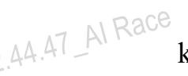
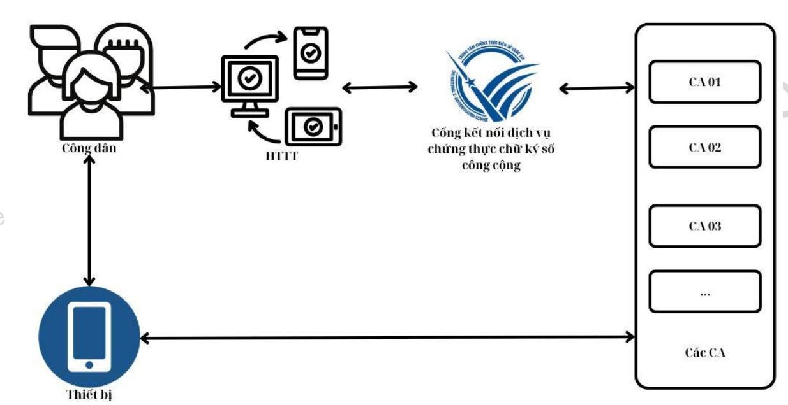

| VIETTEL AI RACE                                                                                                                                  | Public 257      |
|--------------------------------------------------------------------------------------------------------------------------------------------------|-----------------|
| Quy định yêu cầu kỹ thuật đối với phần mềm ký số, phần mềm kiểm tra chữ ký số và Cổng kết nối dịch vụ chứng thực chữ ký số công cộng | Lần ban hành: 1 |

*Căn cứ Luật giao dịch điện tử ngày 22 tháng 06 năm 2023;*

*Căn cứ Nghị định số 23/2025/NĐ-CP ngày 21 tháng 02 năm 2025 của Chính phủ quy định về chữ ký điện tử và dịch vụ tin cậy;*

*Căn cứ Nghị định số 55/2025/NĐ-CP ngày 02 tháng 3 năm 2025 của Chính phủ quy định chức năng, nhiệm vụ và cơ cấu tổ chức của Bộ Khoa học và Công nghệ;*

*Theo đề nghị của Vụ trưởng Vụ Pháp chế và Giám đốc Trung tâm Chứng thực điện tử quốc gia;*

*Bộ trưởng Bộ Khoa học và Công nghệ ban hành Thông tư quy định yêu cầu kỹ thuật đối với phần mềm ký số, phần mềm kiểm tra chữ ký số và Cổng kết nối dịch vụ chứng thực chữ ký số công cộng.*

## **1. QUY ĐỊNH CHUNG**

## **1.1. Phạm vi điều chỉnh**

Thông tư này quy định yêu cầu kỹ thuật đối với phần mềm ký số, phần mềm kiểm tra chữ ký số và Cổng kết nối dịch vụ chứng thực chữ ký số công cộng.

## **1.2 . Đối tượng áp dụng**

Thông tư này áp dụng đối với tổ chức, cá nhân sử dụng phần mềm ký số, phần mềm kiểm tra chữ ký số; các tổ chức, cá nhân phát triển phần mềm ký số, phần mềm kiểm tra chữ ký số; các tổ chức cung cấp dịch vụ chứng thực chữ ký số; các tổ chức cung cấp dịch vụ chứng thực chữ ký điện tử chuyên dùng đảm bảo an toàn; các tổ chức cung cấp dịch vụ chứng thực chữ ký điện tử nước ngoài được công nhận tại Việt Nam; chủ quản các hệ thống thông tin phục vụ giao dịch điện tử có sử dụng chữ ký số và các tổ chức, cá nhân có liên quan khác.

### **1.3. Giải thích từ ngữ**

Trong Thông tư này, các từ ngữ dưới đây được hiểu như sau:

- "Cặp khóa bất đối xứng" là khóa công khai và khóa bí mật tương ứng.
- "Khóa bí mật" là thành phần của cặp khóa bất đối xứng được sử dụng để ký thông điệp dữ liệu.
- "Khóa công khai" là thành phần của cặp khóa bất đối xứng được sử dụng để xác thực chữ ký số trên thông điệp dữ liệu.
- "Chủ thể ký" là cá nhân hoặc tổ chức sở hữu chứng thư chữ ký số và sử dụng khóa bí mật tương ứng để thực hiện ký số trên thông điệp dữ liệu.
- "Chứng thư chữ ký số" là một dạng chứng thư điện tử do tổ chức cung cấp dịch vụ chứng thực chữ ký số cấp nhằm cung cấp thông tin về khóa công khai của một cá nhân, tổ chức từ đó xác nhận cá nhân, tổ chức là chủ thể ký thông qua việc sử dụng khóa bí mật tương ứng.
- "Phần mềm ký số" là chương trình độc lập hoặc một thành phần (module) phần mềm hoặc giải pháp có chức năng ký số vào thông điệp dữ liệu.
- "Phần mềm kiểm tra chữ ký số" là chương trình độc lập hoặc một thành phần (module) phần mềm hoặc giải pháp có chức năng kiểm tra tính hợp lệ của chữ ký số trên thông điệp dữ liệu đã ký.
- "Đường dẫn tin cậy của chứng thư chữ ký số" là thông tin đường dẫn trên chứng thư chữ ký số xác thực tổ chức cung cấp dịch vụ chứng thực chữ ký số đã cấp phát ra chứng thư chữ ký số đó.

# **2. Yêu cầu kỹ thuật đối với chức năng phần mềm ký số, phần mềm kiểm tra chữ ký số**

## **2.1 Yêu cầu chung**

Tuân thủ các yêu cầu và tiêu chuẩn kỹ thuật về chữ ký số trên thông điệp dữ liệu tại Phụ lục I ban hành kèm theo Thông tư này.

## **2.2 Yêu cầu về chức năng**

- Chức năng xác thực chủ thể ký và ký số:
  - + Kiểm tra được thông tin chủ thể ký trên chứng thư chữ ký số;

- + Cho phép chủ thể ký sử dụng khóa bí mật để thực hiện việc ký số vào thông điệp dữ liệu. Khoá bí mật lưu trong thiết bị được chủ thể ký sử dụng để ký số phải tuân thủ các yêu cầu và tiêu chuẩn kỹ thuật tại Phụ lục I ban hành kèm theo Thông tư này;
- + Cho phép chuyển đổi định dạng thông điệp dữ liệu thành các định dạng được nêu tại Phụ lục I ban hành kèm theo Thông tư này;
- + Gắn kèm chữ ký số và chứng thư chữ ký số vào thông điệp dữ liệu sau khi ký số;
- + Hỗ trợ cài đặt, tích hợp chứng thư chữ ký số của Tổ chức cung cấp dịch vụ chứng thực chữ ký số quốc gia và chứng thư chữ ký số thuộc Danh sách tin cậy chứng thư chữ ký điện tử nước ngoài được công nhận tại Việt Nam;
- + Đáp ứng các giao thức gửi nhận thông điệp dữ liệu của phần mềm ký số theo các yêu cầu và tiêu chuẩn tại Phụ lục I ban hành kèm theo Thông tư này.
  - Chức năng kiểm tra hiệu lực của chứng thư chữ ký số:
- + Thông tin trong chứng thư chữ ký số được định danh theo quy định pháp luật về định danh và xác thực điện tử;
- + Chứng thư chữ ký số của chủ thể ký phải được kiểm tra theo đường dẫn tin cậy của chứng thư chữ ký số đó và phải liên kết đến chứng thư chữ ký số gốc của Tổ chức cung cấp dịch vụ chứng thực chữ ký số quốc gia hoặc thuộc Danh sách tin cậy chứng thư chữ ký điện tử nước ngoài được công nhận tại Việt Nam;
- + Chứng thư chữ ký số phải có hiệu lực tại thời điểm ký số và đáp ứng các tiêu chí tại Phụ lục II ban hành kèm theo Thông tư này.
- Chức năng kết nối đến Cổng kết nối dịch vụ chứng thực chữ ký số công cộng: Hướng dẫn kết nối được quy định tại Chương III Thông tư này.
- Chức năng lưu trữ và hủy bỏ các thông tin kèm theo thông điệp dữ liệu ký số, bao gồm:
- + Chứng thư chữ ký số tương ứng với khóa bí mật mà chủ thể ký sử dụng để ký thông điệp dữ liệu tại thời điểm ký số;
- + Danh sách chứng thư chữ ký số thu hồi tại thời điểm ký trong chứng thư chữ ký số của chủ thể ký;
- + Quy chế chứng thực của tổ chức cung cấp dịch vụ chứng thực chữ ký số đã cấp chứng thư chữ ký số tương ứng với chữ ký số trên thông điệp dữ liệu;

- + Kết quả kiểm tra trạng thái chứng thư chữ ký số tương ứng với chữ ký số trên thông điệp dữ liệu đã ký.
- Chức năng thay đổi (thêm, bớt) chứng thư chữ ký số của cơ quan, tổ chức tạo lập cấp, phát hành chứng thư chữ ký số:

Cho phép tích hợp và hiển thị đầy đủ các tổ chức cung cấp dịch vụ chứng thực chữ ký số và Danh sách tin cậy chứng thư chữ ký điện tử nước ngoài được công nhận tại Việt Nam.

- Chức năng thông báo bằng chữ hoặc ký hiệu cho chủ thể ký biết việc ký số vào thông điệp dữ liệu thành công hay không thành công, bao gồm việc:
  - + Hiển thị thông báo ký số thành công hoặc không thành công;
  - + Xem được thông điệp dữ liệu đã ký sau khi hoàn thành ký số;
  - + Tải được thông điệp dữ liệu đã ký về thiết bị.

### **2.3 Yêu cầu chung**

Tuân thủ các yêu cầu và tiêu chuẩn kỹ thuật về chữ ký số trên thông điệp dữ liệu tại Phụ lục I ban hành kèm theo Thông tư này.

### **2.4 Yêu cầu về chức năng**

- Chức năng kiểm tra tính hợp lệ của chữ ký số trên thông điệp dữ liệu:
- + Cho phép xác thực chữ ký số trên thông điệp dữ liệu theo nguyên tắc chữ ký số được tạo ra đúng với khóa bí mật tương ứng với khóa công khai trên chứng thư chữ ký số;
- + Cho phép kiểm tra chứng thư chữ ký số của chủ thể ký theo đường dẫn tin cậy của chứng thư chữ ký số đó và phải liên kết đến Tổ chức cung cấp dịch vụ chứng thực chữ ký số quốc gia hoặc thuộc Danh sách tin cậy chứng thư chữ ký điện tử nước ngoài được công nhận tại Việt Nam;
- + Bảo đảm chứng thư chữ ký số phải có hiệu lực tại thời điểm ký số và đáp ứng các tiêu chí tại Phụ lục II ban hành kèm theo Thông tư này;
- + Cho phép kiểm tra tính toàn vẹn của thông điệp dữ liệu ký số theo các bước sau:
- Giải mã chữ ký số trên thông điệp dữ liệu để có thông tin về mã băm của thông điệp dữ liệu;

- Sử dụng thuật toán hàm băm an toàn đã tạo ra mã băm trên chữ ký số để thực hiện tạo mã băm cho thông điệp dữ liệu;
- So sánh sự trùng khớp của hai mã băm để kiểm tra tính toàn vẹn của thông điệp dữ liệu ký số.
- + Đảm bảo tính hợp lệ của chữ ký số trên thông điệp dữ liệu đã ký theo các tiêu chí tại Phụ lục II ban hành kèm theo Thông tư này;
- + Hỗ trợ cài đặt, tích hợp chứng thư chữ ký số của Tổ chức cung cấp dịch vụ chứng thực chữ ký số quốc gia và chứng thư chữ ký số thuộc danh sách tin cậy chứng thư chữ ký điện tử nước ngoài được công nhận tại Việt Nam;
- + Đáp ứng các giao thức gửi nhận thông điệp dữ liệu của phần mềm ký số theo tiêu chuẩn tại Phụ lục I ban hành kèm theo Thông tư này.
- Chức năng lưu trữ và hủy bỏ các thông tin kèm theo thông điệp dữ liệu ký số:
- + Chứng thư chữ ký số tương ứng với chữ ký số trên thông điệp dữ liệu đã ký;
- + Danh sách chứng thư chữ ký số thu hồi tại thời điểm ký được thể hiện trong chứng thư chữ ký số đính kèm thông điệp dữ liệu đã ký;
- + Quy chế chứng thực của các tổ chức cung cấp dịch vụ chứng thực chữ ký số cấp phát chứng thư chữ ký số tương ứng với các chữ ký số trên thông điệp dữ liệu đã ký;
- + Kết quả kiểm tra trạng thái chứng thư chữ ký số tương ứng với chữ ký số trên thông điệp dữ liệu đã ký.
- Chức năng thay đổi (thêm, bớt) chứng thư chữ ký số của cơ quan, tổ chức tạo lập, cấp, phát hành chứng thư chữ ký số.
- Chức năng thông báo bằng chữ hoặc ký hiệu việc kiểm tra tính hợp lệ của chữ ký số là hợp lệ hay không hợp lệ:
- + Hiển thị thông báo chữ ký số trên thông điệp dữ liệu đã ký hợp lệ hay không hợp lệ;
- + Hiển thị các thông tin về chữ ký số và chứng thư chữ ký số trên thông điệp dữ liệu đã ký, với tối thiểu các trường thông tin sau: thông tin về cơ quan, tổ chức tạo lập, cấp, phát hành chứng thư chữ ký số; thông tin về chủ thể ký; thông

tin về thời điểm ký số hoặc dấu thời gian (nếu có); tính toàn vẹn của thông điệp dữ liệu đã ký; tính hợp lệ của chữ ký số tại thời điểm ký.

# **3. CỔNG KẾT NỐI DỊCH VỤ CHỨNG THỰC CHỮ KÝ SỐ CÔNG CỘNG**

## **3.1 Cổng kết nối dịch vụ chứng thực chữ ký số công cộng**

Cổng kết nối dịch vụ chứng thực chữ ký số công cộng là hệ thống thông tin phục vụ kết nối dịch vụ chứng thực chữ ký số công cộng với các hệ thống thông tin phục vụ giao dịch điện tử sử dụng chữ ký số để bảo đảm tính xác thực, tính toàn vẹn và tính chống chối bỏ của thông điệp dữ liệu.

## **3.2 Kết nối đến Cổng kết nối dịch vụ chứng thực chữ ký số công cộng**

- Các tổ chức cung cấp dịch vụ chứng thực chữ ký số công cộng kết nối đến Cổng kết nối dịch vụ chứng thực chữ ký số công cộng, cụ thể:
- + Thực hiện theo Hướng dẫn kết nối tại Phụ lục III ban hành kèm theo Thông tư này;
- + Cung cấp các đặc tả, thông số kỹ thuật và thông tin phục vụ kết nối cho Tổ chức cung cấp dịch vụ chứng thực điện tử quốc gia;
- + Cập nhật các thông số kỹ thuật hoặc thông tin phục vụ kết nối khi có thay đổi cho Tổ chức cung cấp dịch vụ chứng thực điện tử quốc gia.
- Các hệ thống thông tin phục vụ giao dịch điện tử sử dụng chữ ký số tích hợp với Cổng kết nối dịch vụ chứng thực chữ ký số công cộng để bảo đảm tính xác thực, tính toàn vẹn và tính chống chối bỏ của thông điệp dữ liệu, cụ thể:
- + Thực hiện theo Hướng dẫn kết nối tại Phụ lục III ban hành kèm theo Thông tư này;
- + Bảo đảm chức năng ký số của hệ thống thông tin phục vụ giao dịch điện tử sử dụng chữ ký số đáp ứng các quy định tại Điều 5 Thông tư này;
- + Tổ chức cung cấp dịch vụ chứng thực điện tử quốc gia cung cấp các đặc tả, thông số kỹ thuật và thông tin phục vụ việc kết nối đến Cổng kết nối dịch vụ chứng thực chữ ký số công cộng.
- Đầu mối hỗ trợ, hướng dẫn kết nối đến Cổng kết nối dịch vụ chứng thực chữ ký số công cộng: Trung tâm Chứng thực điện tử quốc gia, Bộ Khoa học và Công nghệ.

# **4. ĐIỀU KHOẢN THI HÀNH**

### **4.1 Tổ chức thực hiện**

- Trung tâm Chứng thực điện tử quốc gia có trách nhiệm hướng dẫn thực hiện các nội dung của Thông tư này và công bố thông tin theo quy định tại điểm c khoản 2 Điều 9 Thông tư này.
- Tổ chức cung cấp dịch vụ chứng thực chữ ký số công cộng, tổ chức cung cấp dịch vụ chứng thực chữ ký điện tử chuyên dùng đảm bảo an toàn, Tổ chức cung cấp dịch vụ chứng thực chữ ký điện tử nước ngoài được công nhận tại Việt Nam có trách nhiệm công bố các đặc tả kỹ thuật (tài liệu và bộ công cụ), chứng thư chữ ký số liên quan đến tổ chức cung cấp dịch vụ chứng thực chữ ký số và các tiêu chuẩn chữ ký số trên trang tin điện tử của tổ chức cung cấp dịch vụ chứng thực chữ ký số đó.
- Tổ chức, cá nhân phát triển, sử dụng phần mềm ký số, phần mềm kiểm tra chữ ký số có trách nhiệm tuân thủ các quy định về yêu cầu kỹ thuật, hướng dẫn sử dụng đối với phần mềm ký số, phần mềm kiểm tra chữ ký số.

#### **4.2 Hiệu lực thi hành**

- Thông tư này có hiệu lực thi hành kể từ ngày tháng năm .
- Chánh Văn phòng, Giám đốc Trung tâm Chứng thực điện tử quốc gia, Thủ trưởng các cơ quan, đơn vị thuộc Bộ, Giám đốc Sở Khoa học và Công nghệ các tỉnh, thành phố trực thuộc Trung ương, tổ chức, cá nhân có liên quan chịu trách nhiệm thi hành Thông tư này.
- Trong quá trình thực hiện, nếu có khó khăn, vướng mắc, cơ quan, tổ chức, cá nhân phản ánh kịp thời về Bộ Khoa học và Công nghệ (Trung tâm Chứng thực điện tử quốc gia) để xem xét, giải quyết./.

### **Phụ lục I**

# **DANH MỤC TIÊU CHUẨN KỸ THUẬT VỀ CHỮ KÝ SỐ TRÊN THÔNG ĐIỆP DỮ LIỆU DÙNG CHO PHẦN MỀM KÝ SỐ VÀ PHẦN MỀM KIỂM TRA CHỮ KÝ SỐ**

*(Ban hành kèm theo Thông tư số /2025/TT-BKHCN ngày tháng năm 2025 của Bộ trưởng Bộ Khoa học và Công nghệ)*

| Số TT | Loại tiêu chuẩn                                 | Ký hiệu tiêu chuẩn        | Tên đầy đủ của tiêu chuẩn                                                | Quy định áp dụng                                |
|-------|----------------------------------------------------|------------------------------|-----------------------------------------------------------------------------|----------------------------------------------------|
|       |                                                    |                              | Tiêu chuẩn về định dạng thông điệp dữ liệu                                  |                                                    |
| 11    | Bộ ký tự và mã hóa                              | ASCII                        | American Standard Code for Information Interchange                    | Khuyến nghị áp dụng                             |
| 12    | Bộ ký tự và mã hóa cho tiếng Việt            | TCVN 6909:2001            | TCVN 6909:2001 " Công nghệ thông tin-Bộ mã ký tự tiếng Việt 16-bit"   | Bắt buộc áp dụng                                |
| 13    | Trình diễn bộ ký tự                             | UTF-8                        | 8-bit Universal Character Set (UCS)/ Unicode Transformation Format | Khuyến nghị áp dụng                             |
| 14    | Ngôn ngữ định dạng thông điệp dữ liệu     | XML v1.0 (5th Edition) | Extensible Markup Language version 1.0 (5th Edition)                  | Khuyến nghị áp dụng một trong hai tiêu chuẩn |
|       |                                                    | XML v1.1 (2nd Edition) | Extensible Markup Language version 1.1                                   |                                                    |
| 15    | Định nghĩa các lược đồ trong tài liệu XML | XML Schema version 1.1 | XML Schema version 1.1                                                      | Khuyến nghị áp dụng                             |
| 16    | Trao đổi dữ liệu đặc tả tài liệu XML         | XML v2.4.2                   | XML Metadata Interchange version 2.4.2                                   | Khuyến nghị áp dụng                             |

| 77   | Quản lý tài liệu - Định dạng tài liệu di động                                                                           | ISO 32000- 1:2008 | Document management - Portable document format                              | Khuyến nghị áp dụng |
|------|----------------------------------------------------------------------------------------------------------------------------------------|----------------------|--------------------------------------------------------------------------------------|------------------------|
| 88   | Định dạng trao đổi dữ liệu theo ký hiệu đối tượng Javascript                                                            | RFC7159              | The JavaScript Object Notation (JSON) Data Interchange Format                  | Khuyến nghị áp dụng |
|      |                                                                                                                                        |                      | Tiêu chuẩn về ký số, kiểm tra chữ ký số                                              |                        |
| 21   | Tiêu chuẩn về ký số trên thiết bị quản lý khóa bí mật, phần mềm ký số, tạo chữ ký số, chứng thư số, phần mềm kiểm tra chữ ký số. |                      |                                                                                      |                        |
| 21.1 | Thuật toán mã hóa                                                                                                                   | TCVN 7816:2007    | Công nghệ thông tin. Kỹ thuật mật mã - thuật toán mã dữ liệu AES            | Khuyến nghị áp dụng |
|      |                                                                                                                                        | NIST 800- 67      | Recommendation for the Triple Data Encryption Algorithm (TDEA) Block Cipher | Khuyến nghị áp dụng |
|      |                                                                                                                                        | PKCS#1               | RSA Cryptography Standard (Phiên bản 2.1 trở lên)                           | Khuyến nghị áp dụng |
|      |                                                                                                                                        |                      | Áp dụng, sử dụng lược đồ RSAES-OAEP để mã hoá                               |                        |
|      |                                                                                                                                        |                      | Độ dài khóa tối thiểu là 2048 bit                                                 |                        |
|      |                                                                                                                                        | ECC                  | Elliptic Curve Crytography                                                        | Khuyến nghị áp dụng |
| 21.2 | Thuật toán chữ ký số                                                                                                                | TCVN 7635:2007    | Các kỹ thuật mật mã - Chữ ký số                                                   |                        |

|      |                           | PKCS#1 ANSI X9.62-2005 | RSA Cryptography Standard Public Key Cryptography for the Financial Services Industry: The Elliptic Curve Digital Signature Algorithm (ECDSA) | - Áp dụng một trong ba tiêu chuẩn. - Đối với tiêu chuẩn TCVN 7635:2007 và PKCS#1: + Phiên bản 2.1 + Áp dụng lược đồ RSAES OAEP để mã hoá và RSASSA PSS để ký. + Độ dài khóa tối thiểu là 2048 bit - Đối với tiêu chuẩn ECDSA: độ dài khóa tối thiểu là 256 bit |  |
|------|---------------------------|------------------------------|--------------------------------------------------------------------------------------------------------------------------------------------------------------------|-------------------------------------------------------------------------------------------------------------------------------------------------------------------------------------------------------------------------------------------------------------------------------------------------------------------------------------------|--|
| 21.3 | Hàm băm an toàn        | FIPS PUB 180-4            | Secure Hash Algorithms                                                                                                                                             | Áp dụng một trong các hàm                                                                                                                                                                                                                                                                                                              |  |
|      |                           | FIPS PUB 202              | SHA-3 Standard: Permutation-Based Hash and Extendable-Output Functions                                                                                    | băm sau: SHA-224, SHA-256, SHA-384, SHA-512, SHA-512/224, SHA-512/256, SHA3-224, SHA3-256, SHA3-384, SHA3-512, SHAKE128, SHAKE256                                                                                                                                                                     |  |
| 21.4 | Cú pháp mã hóa và cách | XML Encryption            | XML Encryption Syntax and Processing                                                                                                                            | Bắt buộc áp dụng                                                                                                                                                                                                                                                                                                                       |  |

|      | xử lý thông điệp dữ liệu                                                                          | Syntax and Processing                     |                                                                                                             |                                                                 |  |
|------|------------------------------------------------------------------------------------------------------|----------------------------------------------|-------------------------------------------------------------------------------------------------------------|-----------------------------------------------------------------|--|
|      | định dạng XML                                                                                     | XML Signature Syntax and Processing | XML Signature Syntax and Processing                                                                      | Bắt buộc áp dụng                                             |  |
| 21.5 | Quản lý khóa công khai thông điệp dữ liệu định dạng XML                                  | XKMS v2.0                                    | XML Key Management Specification version 2.0                                                             | Bắt buộc áp dụng                                             |  |
| 21.6 | Cú pháp thông điệp mật mã cho ký, mã hóa                                                    | PKCS#7 v1.5 (RFC 2315)                 | Cryptographic message syntax for file-based signing and encrypting version 1.5                     | Bắt buộc áp dụng                                             |  |
| 11.7 | Tiêu chuẩn về chữ ký điện tử nâng cao dành cho thông điệp dữ liệu định dạng PDF | ETSI EN 319 142-1                         | Electronic Signatures and Infrastructures (ESI) - PAdES digital signatures                      | Áp dụng một trong hai tiêu chuẩn PAdES hoặc CAdES      |  |
| 11.8 | Tiêu chuẩn về chữ ký điện tử nâng cao dành cho thông điệp dữ liệu định dạng XML    | ETSI TS 101 903                           | Electronic Signatures and Infrastructures (ESI) - XML Advanced Electronic Signatures (XAdES) | Áp dụng một trong hai tiêu chuẩn XAdES hoặc CAdES      |  |
| 11.9 | Tiêu chuẩn về chữ ký điện tử nâng cao dành cho thông điệp dữ liệu định dạng JSON   | RFC 7515                                     | JSON Web Signature (JWS)                                                                                 | Bắt buộc áp dụng cho thông điệp dữ liệu định dạng JSON |  |

| 11.10                                               | Tiêu chuẩn về chữ ký điện tử nâng cao dành cho cú pháp tin nhắn mật mã                                                          | ETSI TS 101 733                                                                                                                                                                      | Electronic Signatures and Infrastructures (ESI) - CMS Advanced Electronic Signatures (CAdES)                                                                                                               | Khuyến nghị áp dụng                                                  |
|-----------------------------------------------------|------------------------------------------------------------------------------------------------------------------------------------------------|-----------------------------------------------------------------------------------------------------------------------------------------------------------------------------------------|---------------------------------------------------------------------------------------------------------------------------------------------------------------------------------------------------------------------------|-------------------------------------------------------------------------|
| .2                                                  |                                                                                                                                                |                                                                                                                                                                                         | Tiêu chuẩn về hệ thống, thiết bị lưu trữ và sử dụng khóa bí mật                                                                                                                                                           |                                                                         |
| 22.1                                                | Yêu cầu an toàn dành cho mô đun bảo mật phần cứng                                                                                  | FIPS PUB 140-2                                                                                                                                                                       | Security Requirements for Cryptographic Modules                                                                                                                                                                     | - Yêu cầu tối thiểu mức 3 (level 3)                            |
| 22.2                                                | Yêu cầu an toàn đối với thẻ Token và Smart card                                                                                       | FIPS PUB 140-2                                                                                                                                                                       | Security Requirements for Cryptographic Modules                                                                                                                                                                     | - Yêu cầu tối thiểu mức 2 (level 2)                            |
| .2.3                                                | Yêu cầu về chính sách và an toàn cho các tổ chức cung cấp dịch vụ tin cậy: Các thành phần dịch vụ vận hành thiết bị | ETSI TS 119 431-1 ETSI TS                                                                                                                                                         | Electronic Signatures and Infrastructures (ESI); Policy and security requirements for trust service providers; Part 1: TSP service components operating a remote QSCD/SCDev Electronic Signatures | Áp dụng cả bộ tiêu chuẩn 2 phần; Phiên bản V1.1.1 (12/2018) |
| tạo chữ ký số và hỗ trợ tạo chữ ký số AdES | 119 431-2                                                                                                                                      | and Infrastructures (ESI); Policy and security requirements for trust service providers; Part 2: TSP service components supporting AdES digital signature creation |                                                                                                                                                                                                                           |                                                                         |
| .2.4                                                | Giao thức tạo chữ ký số từ xa                                                                                                            | ETSI TS 119 432                                                                                                                                                                      | Electronic Signatures and Infrastructures (ESI); Protocols for                                                                                                                                                      | Phiên bản V1.1.1 (03/2019)                                           |

|      |                                                                                                                                                                                               |                         | remote digital signature creation                                                                                  |                                                        |
|------|-----------------------------------------------------------------------------------------------------------------------------------------------------------------------------------------------|-------------------------|-----------------------------------------------------------------------------------------------------------------------|--------------------------------------------------------|
| .2.5 | Hệ thống tin cậy hỗ trợ ký số từ xa - Các yêu cầu chung                                                                                                                           | EN 419241- 1:2018 | Trustworthy Systems Supporting Server Signing - Part 1: General system security requirements           |                                                        |
| .2.6 | Hệ thống tin cậy hỗ trợ ký số từ xa – Yêu cầu và mục tiêu (hồ sơ bảo vệ) của thiết bị tạo chữ ký số dành cho ký số từ xa                                     | EN 419241- 2:2019 | Trustworthy Systems Supporting Server Signing - Part 2: Protection Profile for QSCD for Server Signing |                                                        |
| .2.7 | Yêu cầu và mục tiêu (hồ sơ bảo vệ) dành cho mô đun bảo mật phần cứng của tổ chức cung cấp dịch vụ tin cậy – mô đun mã hóa dành cho các dịch vụ tin cậy | EN 419221- 5:2018 | Protection Profiles for TSP Cryptographic modules - Part 5: Cryptographic Module for Trust Services    |                                                        |
| 33   | Tiêu chuẩn kiểm tra trạng thái chứng thư số                                                                                                                                                   |                         |                                                                                                                       |                                                        |
| 33.1 | Giao thức truyền, nhận chứng thư chữ ký số và danh sách chứng thư                                                                                                           | RFC 2585                | Internet X.509 Public Key Infrastructure - Operational Protocols: FTP and HTTP                               | Áp dụng một hoặc cả hai giao thức FTP và HTTP |

|      | chữ ký số bị thu hồi                                                     |          |                                                                                            |                                  |
|------|--------------------------------------------------------------------------------|----------|--------------------------------------------------------------------------------------------|----------------------------------|
| 33.2 | Giao thức bảo mật tầng giao vận                                          | RFC 8446 | The Transport Layer Security (TLS) Protocol Version 1.3                              | Bắt buộc áp dụng tối thiểu |
| 33.3 | Giao thức cho kiểm tra trạng thái chứng thư chữ ký sốtrực tuyến | RFC 2560 | X.509 Internet Public Key Infrastructure - On line Certificate status protocol |                                  |

### **Phụ lục II**

# **DANH MỤC TIÊU CHÍ ĐÁNH GIÁ HIỆU LỰC CỦA CHỨNG THƯ CHỮ KÝ SỐ VÀ CHỮ KÝ SỐ HỢP LỆ TRONG PHẦN MỀM KÝ SỐ, PHẦN MỀM KIỂM TRA CHỮ KÝ SỐ**

*(Ban hành kèm theo Thông tư số /2025/TT-BKHCN ngày tháng năm 2025 của Bộ trưởng Bộ Khoa học và Công nghệ)*

| Số TT | Tiêu chí đánh giá                                                                                                                                                                                                                                                                                                                     | Hiệu lực/hợp lệ                                                                                                                                                                                                      | Quy định áp dụng |  |  |
|-------|---------------------------------------------------------------------------------------------------------------------------------------------------------------------------------------------------------------------------------------------------------------------------------------------------------------------------------------|----------------------------------------------------------------------------------------------------------------------------------------------------------------------------------------------------------------------|------------------|--|--|
| 1     | Tính hiệu lực của chứng thư chữ ký số                                                                                                                                                                                                                                                                                                 |                                                                                                                                                                                                                      |                  |  |  |
| 1.1   | Thời gian có hiệu lực của chứng thư số                                                                                                                                                                                                                                                                                             | Thời gian trên chứng thư chữ ký số còn hiệu lực tại thời điểm ký số                                                                                                                                      | Bắt buộc áp dụng |  |  |
| 1.2   | Trạng thái chứng thư số qua danh sách chứng thư chữ ký số thu hồi (CRL) được công bố tại thời điểm ký số hoặc bằng phương pháp kiểm tra trạng thái chứng thư chữ ký số trực tuyến (OCSP) ở chế độ trực tuyến trong trường hợp tổ chức cung cấp dịch vụ chứng thực chữ ký số có cung cấp dịch vụ OCSP | Trạng thái của chứng thư chữ ký số còn hoạt động tại thời điểm ký số                                                                                                                                        | Bắt buộc áp dụng |  |  |
| 1.3   | Thuật toán mật mã trên chứng thư chữ ký số                                                                                                                                                                                                                                                                                         | Các thuật toán mật mã trên chứng thư chữ ký số tuân thủ theo quy định về quy chuẩn, tiêu chuẩn kỹ thuật bắt buộc áp dụng về chữ ký số và dịch vụ chứng thực chữ ký số đang có hiệu lực | Bắt buộc áp dụng |  |  |
| 1.4   | Mục đích, phạm vi sử dụng của chứng thư chữ ký số                                                                                                                                                                                                                                                                                  | Chứng thư chữ ký số được sử dụng đúng mục đích, phạm vi sử dụng                                                                                                                                             | Bắt buộc áp dụng |  |  |

| 1.5 | Các tuyên bố khác của Tổ chức cung cấp dịch vụ chứng thực chữ ký số | Các tuyên bố khác không nằm ngoài phạm vi Quy chế chứng thực của Tổ chức cung cấp dịch vụ chứng thực chữ ký số | Khuyến nghị áp dụng |  |  |
|-----|---------------------------------------------------------------------------|----------------------------------------------------------------------------------------------------------------------------------|------------------------|--|--|
| 2   | Tính hợp lệ của chữ ký số                                                 |                                                                                                                                  |                        |  |  |
| 2.1 | Thông tin về chủ thể ký                                                   | Kiểm tra, xác thực được đúng thông tin chủ thể ký số                                                                    | Bắt buộc áp dụng       |  |  |
| 2.2 | Cách thức tạo chữ ký số                                                   | Chữ ký số được tạo ra đúng bởi khóa bí mật tương ứng với khóa công khai trên chứng thư chữ ký số                     | Bắt buộc áp dụng       |  |  |
| 2.3 | Chứng thư chữ ký số kèm theo thông điệp dữ liệu                        | Chứng thư chữ ký số có hiệu lực tại thời điểm ký                                                                           | Bắt buộc áp dụng       |  |  |
| 2.4 | Tính toàn vẹn của thông điệp dữ liệu                                   | Mã băm có được từ việc băm thông điệp dữ liệu và mã băm có được khi giải mã chữ ký số trùng nhau                     | Bắt buộc áp dụng       |  |  |

### **Phụ lục III**

# **HƯỚNG DẪN KẾT NỐI ĐẾN CỔNG KẾT NỐI DỊCH VỤ CHỨNG THỰC CHỮ KÝ SỐ CÔNG CỘNG**

*(Ban hành kèm theo Thông tư số /2025/TT-BKHCN ngày tháng năm 2025 của Bộ trưởng Bộ Khoa học và Công nghệ)*

# **1. Mô hình kết nối**

Mô hình kết nối với Cổng kết nối dịch vụ chứng thực chữ ký số công cộng (sau đây gọi là Cổng eSign) được mô tả tại sơ đồ như sau:

### Chú thích:

- HTTT: Hệ thống thông tin phục vụ giao dịch điện tử sử dụng chữ ký số.
- CA: Tổ chức cung cấp dịch vụ chứng thực chữ ký số công cộng.

# **2. Các thông tin hướng dẫn kết nối**

- a) Giao thức sử dụng để kết nối là API, phương thức kết nối là POST.
- b) Đường dẫn kết nối các API: [https://esign.neac.gov.vn](https://esign.neac.gov.vn/)
- c) Thông tin Cổng eSign cung cấp cho các HTTT gồm: sp\_id và sp\_password hoặc token, trong đó:
  - sp\_id: Mã xác thực được cấp cho HTTT.
  - sp\_password: Mật khẩu kết nối được cấp cho HTTT tương ứng với sp\_id.
  - token: Thông tin xác thực được cấp cho HTTT.