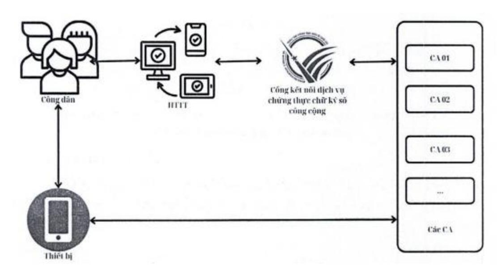

#### **1. Quy định chung**

## **1.1 Phạm vi điều chỉnh**

Thông tư này quy định các nội dung sau:

- 1. Yêu cầu kỹ thuật đối với phần mềm ký số, phần mềm kiểm tra chữ ký số theo quy định tại Điều 17, Nghị định số 23/2025/NĐ-CP ngày 21 tháng 02 năm 2025 của Chính phủ quy định về chữ ký điện tử và dịch vụ tin cậy.
- 2. Hướng dẫn kết nối đến Cổng kết nối dịch vụ chứng thực chữ ký số công cộng do Bộ Khoa học và Công nghệ xây dựng theo quy định tại Điều 44, Nghị định số 23/2025/NĐ-CP ngày 21 tháng 02 năm 2025 của Chính phủ quy định về chữ ký điện tử và dịch vụ tin cậy.

## **1.2 Đối tượng áp dụng**

Thông tư này áp dụng:

- 1. Tổ chức, cá nhân sử dụng phần mềm ký số, phần mềm kiểm tra chữ ký số; các tổ chức, cá nhân phát triển phần mềm ký số, phần mềm kiểm tra chữ ký số; các Tổ chức cung cấp dịch vụ chứng thực chữ ký số khi phát triển, sử dụng phần mềm ký số, phần mềm kiểm tra chữ ký số.
- 2. Các Tổ chức cung cấp dịch vụ chứng thực chữ ký số; các Tổ chức cung cấp dịch vụ chứng thực chữ ký điện tử nước ngoài được công nhận tại Việt Nam; chủ quản các hệ thống thông tin phục vụ giao dịch điện tử có sử dụng chữ ký số khi kết nối đến Cổng kết nối dịch vụ chứng thực chữ ký số công cộng.
- 3. Các tổ chức, cá nhân có liên quan khác.

#### **1.3 Giải thích từ ngữ**

Trong Thông tư này, các từ ngữ dưới đây được hiểu như sau:

- 1. "Cặp khóa không đối xứng" là khóa công khai và khóa bí mật tương ứng.
- 2. "Khóa bí mật" là thành phần của cặp khóa không đối xứng được sử dụng để ký thông điệp dữ liệu.
- 3. "Khóa công khai" là thành phần của cặp khóa không đối xứng được sử dụng để xác thực chữ ký số trên thông điệp dữ liệu.

- 4. "Hàm băm" là một thuật toán chuyển đổi thông điệp dữ liệu đầu vào thành một chuỗi có độ dài cố định, gọi là mã băm. Hàm băm được sử dụng để kiểm tra tính toàn vẹn của thông điệp dữ liệu và tạo chữ ký số.
- 5. "Chủ thể ký" là cá nhân hoặc tổ chức sở hữu chứng thư chữ ký số và sử dụng khóa bí mật tương ứng để thực hiện ký số trên thông điệp dữ liệu.
- 6. "Chứng thư chữ ký số" là một dạng chứng thư chữ ký điện tử do Tổ chức cung cấp dịch vụ chứng thực chữ ký số cấp nhằm cung cấp thông tin về khóa công khai của một cá nhân, tổ chức từ đó xác nhận cá nhân, tổ chức là chủ thể ký thông qua việc sử dụng khóa bí mật tương ứng.
- 7. "Phần mềm ký số" là chương trình độc lập hoặc một thành phần (module) phần mềm hoặc giải pháp có chức năng ký số vào thông điệp dữ liệu.
- 8. "Phần mềm kiểm tra chữ ký số" là chương trình độc lập hoặc một thành phần (module) phần mềm hoặc giải pháp có chức năng kiểm tra tính hợp lệ của chữ ký số trên thông điệp dữ liệu đã ký. 10. "Đường dẫn tin cậy của chứng thư chữ ký số" là danh sách có thứ tự các chứng thư chữ ký số, bao gồm chứng thư chữ ký số của thuê bao, chứng thư chữ ký số của các Tổ chức cung cấp dịch vụ chứng thực chữ ký số và chứng thư chữ ký số gốc tin cậy nhằm xác minh nguồn gốc của chứng thư chữ ký số.

## **2. Yêu cầu kỹ thuật đối với chức năng phần mềm ký số, phần mềm kiểm tra chữ ký số**

### **2.1 Yêu cầu chung**

Tuân thủ các yêu cầu và tiêu chuẩn kỹ thuật về chữ ký số trên thông điệp dữ liệu dùng cho phần mềm ký số và phần mềm kiểm tra chữ ký số tại Phụ lục I ban hành kèm theo Thông tư này.

## **2.2 Yêu cầu về chức năng đối với phần mềm ký số**

## **Chức năng xác thực chủ thể ký và ký số**

a) Kiểm tra được thông tin chủ thể ký trên chứng thư chữ ký số và kiểm tra hiệu lực chứng thư chữ ký số theo quy định tại khoản 2 Điều này trước khi cho phép thực hiện ký số;

- b) Cho phép chủ thể ký sử dụng khóa bí mật để thực hiện việc ký số vào thông điệp dữ liệu. Khoá bí mật lưu trong phương tiện lưu khóa bí mật được chủ thể ký sử dụng hoặc ủy quyền sử dụng để ký số phải tuân thủ các tiêu chuẩn bắt buộc áp dụng cho chữ ký số, chứng thư chữ ký số trên thông điệp dữ liệu dùng cho phần mềm ký số và phần mềm kiểm tra chữ ký số tại Phụ lục I ban hành kèm theo Thông tư này;
- c) Cho phép chuyển đổi định dạng thông điệp dữ liệu thành các định dạng theo tiêu chuẩn khuyến nghị áp dụng cho phần mềm ký số, phần mềm kiểm tra chữ ký số tại Phụ lục I ban hành kèm theo Thông tư này;
- d) Cho phép gắn kèm chữ ký số, chứng thư chữ ký số và thời điểm ký số vào thông điệp dữ liệu sau khi ký số;
- đ) Hỗ trợ cài đặt, tích hợp, cập nhật chứng thư chữ ký số của Trung tâm Chứng thực điện tử quốc gia, các Tổ chức cung cấp dịch vụ chứng thực chữ ký số công cộng và chứng thư chữ ký số thuộc Danh sách tin cậy chứng thư chữ ký điện tử nước ngoài được công nhận tại Việt Nam;
- e) Cho phép gắn dấu thời gian tương ứng với chữ ký số trên thông điệp dữ liệu trong trường hợp pháp luật quy định thông điệp dữ liệu cần có dấu thời gian;
- g) Đảm bảo tính toàn vẹn của thông điệp dữ liệu đã ký.

## **Chức năng kiểm tra hiệu lực của chứng thư chữ ký số**

- a) Xác thực được thông tin trong chứng thư chữ ký số theo quy định pháp luật về định danh và xác thực điện tử;
- b) Kiểm tra được chứng thư chữ ký số của chủ thể ký theo đường dẫn tin cậy của chứng thư chữ ký số đó hoặc theo Danh sách tin cậy chứng thư chữ ký điện tử nước ngoài được công nhận tại Việt Nam. Đường dẫn tin cậy phải có liên kết đến chứng thư chữ ký số gốc của Trung tâm Chứng thực điện tử quốc gia;
- c) Đáp ứng các yêu cầu về tính hiệu lực của chứng thư chữ ký số tại Phụ lục II ban hành kèm theo Thông tư này.

## **Chức năng kết nối đến Cổng kết nối dịch vụ chứng thực chữ ký số công cộng**

- a) Phát triển các thành phần, chương trình hoặc giải pháp phục vụ kết nối đến Cổng kết nối dịch vụ chứng thực chữ ký số công cộng;
- b) Tuân thủ Hướng dẫn kết nối đến Cổng kết nối dịch vụ chứng thực chữ ký số công cộng do Bộ Khoa học và Công nghệ xây dựng được quy định tại Điều 8 Thông tư này.

## **QUY ĐỊNH YÊU CẦU KỸ THUẬT ĐỐI VỚI PHẦN MỀM KÝ SỐ, PHẦN MỀM KIỂM TRA CHỮ KÝ SỐ VÀ CỔNG KẾT NỐI DỊCH VỤ CHỨNG THỰC CHỮ KÝ SỐ CÔNG CỘNG** Lần ban hành: 1

## **Chức năng lưu trữ và hủy bỏ các thông tin kèm theo thông điệp dữ liệu ký số, bao gồm:**

- a) Chứng thư chữ ký số tương ứng với khóa bí mật mà chủ thể ký sử dụng để ký thông điệp dữ liệu tại thời điểm ký số;
- b) Danh sách chứng thư chữ ký số thu hồi tại thời điểm ký trong chứng thư chữ ký số của chủ thể ký;
- c) Kết quả kiểm tra trạng thái chứng thư chữ ký số tương ứng với chữ ký số trên thông điệp dữ liệu đã ký.

## **Chức năng thay đổi (thêm, bớt) chứng thư chữ ký số của cơ quan, tổ chức tạo lập cấp, phát hành chứng thư chữ ký số:** Cho phép tích hợp và hiển thị đầy đủ các Tổ chức cung cấp dịch vụ chứng thực chữ ký số và Danh sách tin cậy chứng thư chữ ký điện tử nước ngoài được công nhận tại Việt Nam.

## **Chức năng thông báo bằng chữ hoặc ký hiệu cho chủ thể ký biết việc ký số vào thông điệp dữ liệu thành công hay không thành công, bao gồm việc:**

- a) Hiển thị thông báo về kết quả kiểm tra hiệu lực chứng thư chữ ký số;
- b) Hiển thị thông báo ký số thành công hoặc không thành công bằng tiếng Việt;
- c) Tải được thông điệp dữ liệu đã ký về thiết bị.

## **2.3 Yêu cầu về chức năng đối với phần mềm kiểm tra chữ ký số**

## **Chức năng kiểm tra tính hợp lệ của chữ ký số trên thông điệp dữ liệu:**

- a) Cho phép xác thực chữ ký số trên thông điệp dữ liệu theo nguyên tắc chữ ký số được tạo ra đúng với khóa bí mật tương ứng với khóa công khai trên chứng thư chữ ký số gắn kèm chữ ký số;
- b) Cho phép kiểm tra chứng thư chữ ký số của chủ thể ký theo đường dẫn tin cậy của chứng thư chữ ký số đó và phải liên kết đến Trung tâm Chứng thực điện tử quốc gia hoặc thuộc Danh sách tin cậy chứng thư chữ ký điện tử nước ngoài được công nhận tại Việt Nam;
- c) Bảo đảm chứng thư chữ ký số phải đáp ứng các yêu cầu về tính hiệu lực của chứng thư chữ ký số và tính hợp lệ của chữ ký số tại Phụ lục II ban hành kèm theo Thông tư này;
- d) Cho phép kiểm tra tính toàn vẹn của thông điệp dữ liệu ký số theo các bước sau: giải mã chữ ký số trên thông điệp dữ liệu bằng khóa công khai trên chứng thư chữ ký số để có thông tin về mã băm của thông điệp dữ liệu; sử dụng hàm băm đã tạo ra mã băm trên chữ ký số

để thực hiện tạo mã băm cho thông điệp dữ liệu nhận được; so sánh sự trùng khớp của hai mã băm để kiểm tra tính toàn vẹn của thông điệp dữ liệu ký số;

- đ) Đảm bảo kiểm tra được tính hợp lệ của chữ ký số trên thông điệp dữ liệu đã ký theo các yêu cầu về tính hợp lệ của chữ ký số tại Phụ lục II ban hành kèm theo Thông tư này;
- e) Hỗ trợ cài đặt, tích hợp, cập nhật chứng thư chữ ký số của Trung tâm Chứng thực điện tử quốc gia, các Tổ chức cung cấp dịch vụ chứng thực chữ ký số công cộng và chứng thư chữ ký số thuộc Danh sách tin cậy chứng thư chữ ký điện tử nước ngoài được công nhận tại Việt Nam;
- g) Đảm bảo tính hợp lệ của dấu thời gian gắn kèm với chữ ký số trong trường hợp chữ ký số được gắn dấu thời gian;
- h) Đảm bảo tính toàn vẹn của thông điệp dữ liệu đã ký.

### **Chức năng lưu trữ và hủy bỏ các thông tin kèm theo thông điệp dữ liệu ký số:**

- a) Chứng thư chữ ký số tương ứng với chữ ký số trên thông điệp dữ liệu đã ký;
- b) Danh sách chứng thư chữ ký số thu hồi tại thời điểm ký được thể hiện trong chứng thư chữ ký số đính kèm thông điệp dữ liệu đã ký;
- c) Kết quả kiểm tra trạng thái chứng thư chữ ký số tương ứng với chữ ký số trên thông điệp dữ liệu đã ký.
  - **Chức năng thay đổi (thêm, bớt) chứng thư chữ ký số của cơ quan, tổ chức tạo lập, cấp, phát hành chứng thư chữ ký số.**

## **Chức năng thông báo bằng chữ hoặc ký hiệu việc kiểm tra tính hợp lệ của chữ ký số là hợp lệ hay không hợp lệ:**

- a) Hiển thị thông báo chữ ký số trên thông điệp dữ liệu đã ký hợp lệ hay không hợp lệ bằng tiếng Việt;
- b) Hiển thị các thông tin về chữ ký số và chứng thư chữ ký số trên thông điệp dữ liệu đã ký, với tối thiểu các trường thông tin sau: thông tin về cơ quan, tổ chức tạo lập, cấp, phát hành chứng thư chữ ký số; thông tin về chủ thể ký; thông tin về đơn vị quản lý chứng thư chữ ký số; thông tin về thời điểm ký số hoặc dấu thời gian (nếu có); tính toàn vẹn của thông điệp dữ liệu đã ký; tính hợp lệ của chữ ký số tại thời điểm ký; thời hạn có hiệu lực của chứng thư chữ ký số.

## **3. Cổng kết nói dịch vụ chứng thực chữ ký só công cộng**

### **3.1 Cổng kết nối dịch vụ chứng thực chữ ký số công cộng**

- 1. Cổng kết nối dịch vụ chứng thực chữ ký số công cộng do Bộ Khoa học và Công nghệ xây dựng được quy định tại Nghị định số 42/2022/NĐ-CP.
- 2. Cổng kết nối dịch vụ chứng thực chữ ký số công cộng do Bộ Khoa học và Công nghệ xây dựng phục vụ kết nối dịch vụ chứng thực chữ ký số công cộng với các hệ thống thông tin phục vụ giao dịch điện tử sử dụng chữ ký số để bảo đảm tính xác thực, tính toàn vẹn và tính chống chối bỏ của thông điệp dữ liệu.
- **3.2 Kết nối đến Cổng kết nối dịch vụ chứng thực chữ ký số công cộng do Bộ Khoa học và Công nghệ xây dựng**
  - **Các Tổ chức cung cấp dịch vụ chứng thực chữ ký số công cộng kết nối đến Cổng kết nối dịch vụ chứng thực chữ ký số công cộng do Bộ Khoa học và Công nghệ xây dựng, cụ thể:**
- a) Thực hiện theo Hướng dẫn kết nối tại Phụ lục III ban hành kèm theo Thông tư này;
- b) Cung cấp các đặc tả, thông số kỹ thuật và thông tin phục vụ kết nối cho Trung tâm Chứng thực điện tử quốc gia;
- c) Cập nhật các thông số kỹ thuật hoặc thông tin phục vụ kết nối khi có thay đổi cho Trung tâm Chứng thực điện tử quốc gia.
  - **Các hệ thống thông tin phục vụ giao dịch điện tử sử dụng chữ ký số tích hợp với Cổng kết nối dịch vụ chứng thực chữ ký số công cộng do Bộ Khoa học và Công nghệ xây dựng để bảo đảm tính xác thực, tính toàn vẹn và tính chống chối bỏ của thông điệp dữ liệu, cụ thể:**
- a) Thực hiện theo Hướng dẫn kết nối tại Phụ lục III ban hành kèm theo Thông tư này;
- b) Bảo đảm chức năng ký số của hệ thống thông tin phục vụ giao dịch điện tử sử dụng chữ ký số đáp ứng các quy định tại Điều 5 Thông tư này;

- **Trung tâm Chứng thực điện tử quốc gia cung cấp, cập nhật các đặc tả, thông số kỹ thuật và thông tin phục vụ việc kết nối đến Cổng kết nối dịch vụ chứng thực chữ ký số công cộng.**
- **Đầu mối hỗ trợ, hướng dẫn kết nối đến Cổng kết nối dịch vụ chứng thực chữ ký số công cộng do Bộ Khoa học và Công nghệ xây dựng: Trung tâm Chứng thực điện tử quốc gia, Bộ Khoa học và Công nghệ.**

## **4. Điều khoản thi hành**

## **4.1 Tổ chức thực hiện**

- Trung tâm Chứng thực điện tử quốc gia có trách nhiệm hướng dẫn thực hiện các nội dung của Thông tư này và công bố thông tin theo quy định tại khoản 3 Điều 8 Thông tư này.
- Tổ chức cung cấp dịch vụ chứng thực chữ ký số công cộng, Tổ chức cung cấp dịch vụ chứng thực chữ ký điện tử nước ngoài được công nhận tại Việt Nam có trách nhiệm công bố chứng thư chữ ký số liên quan đến Tổ chức cung cấp dịch vụ chứng thực chữ ký số và các tiêu chuẩn chữ ký số trên trang tin điện tử của Tổ chức cung cấp dịch vụ chứng thực chữ ký số đó.

#### **4.2 Hiệu lực thi hành**

- Thông tư này có hiệu lực thi hành kể từ ngày ký ban hành.
- Thông tư số 22/2020/TT-BTTTT ngày 07 tháng 9 năm 2020 của Bộ Thông tin và Truyền thông quy định về yêu cầu kỹ thuật đối với phần mềm ký số, phần mềm kiểm tra chữ ký số hết hiệu lực kể từ ngày Thông tư này có hiệu lực thi hành.
- Các hệ thống thông tin khi tiến hành phát triển, tích hợp phần mềm, ứng dụng sử dụng chữ ký số thực hiện theo các quy định tại Thông tư này.
- Chánh Văn phòng, Giám đốc Trung tâm Chứng thực điện tử quốc gia, Thủ trưởng các cơ quan, đơn vị thuộc Bộ, Giám đốc Sở Khoa học và Công nghệ các tỉnh, thành phố trực thuộc Trung ương, cơ quan quản lý nhà nước về giao dịch điện tử theo quy định của pháp luật, tổ chức, cá nhân có liên quan chịu trách nhiệm thi hành Thông tư này.
- Trong quá trình thực hiện, nếu có khó khăn, vướng mắc, cơ quan, tổ chức, cá nhân phản ánh kịp thời về Bộ Khoa học và Công nghệ (Trung tâm Chứng thực điện tử quốc gia) để xem xét, giải quyết.

## **QUY ĐỊNH YÊU CẦU KỸ THUẬT ĐỐI VỚI PHẦN MỀM KÝ SỐ, PHẦN MỀM KIỂM TRA CHỮ KÝ SỐ VÀ CỔNG KẾT NỐI DỊCH VỤ CHỨNG THỰC CHỮ KÝ SỐ CÔNG CỘNG** Lần ban hành: 1

## PHẦN 1: DANH MỤC TIỂU CHUẢN KỸ THUẬT VỀ CHỮ KÝ SÓ TRÊN THÔNG ĐIỆP DỮ LIỆU DUNG CHO PHẦN MỀM KÝ SÓ VÀ PHẦN MỀM KIỂM TRA CHỮ KÝ SỐ

| Số TT | Loại tiêu chuẩn                                                                                                                                            | Ký hiệu tiêu chuẩn          | Tên đầy đủ của tiêu chuẩn                                                                                                                      | Quy định áp dụng                                                                                                                                                                                                          |  |  |
|----------|------------------------------------------------------------------------------------------------------------------------------------------------------------|-----------------------------|---------------------------------------------------------------------------------------------------------------------------------------------------|---------------------------------------------------------------------------------------------------------------------------------------------------------------------------------------------------------------------------|--|--|
| tra chữ  | 1. Tiêu chuẩn bắt buộc áp dụng cho chữ ký số, chứng thư chữ ký số trên thông điệp dữ liệu dùng cho phần mềm ký số và phần mềm kiểm ký số |                             |                                                                                                                                                   |                                                                                                                                                                                                                           |  |  |
| 1.1      | Mật mã đối xứng                                                                                                                                            | TCVN 7816:2007              | Công nghệ thông tin - Kỹ thuật mật mã thuật toản mã dũ liệu AES                                                                       | Áp dụng một trong hai tiêu chuẩn                                                                                                                                                                                          |  |  |
|          |                                                                                                                                                            | FIPS PUB 197                | Advanced Encryption Standard                                                                                                                      |                                                                                                                                                                                                                           |  |  |
| 1.2      | Mật mã phi đối xứng và chữ ký                                                                                                                        | PKCS #1 (RFC 3447) | RSA Cryptography Standard                                                                                                                         | - Áp dụng một trong hai tiêu chuẩn -Đối với tiêu chuẩn RSA:                                                                                                                                                         |  |  |
|          | số                                                                                                                                                         | ANSI X9.62-2005             | Public Key Cryptography for the Financial Services Industry: The Elliptic Curve Digital Signature Algorithm (ECDSA) | + Tối thiểu phiên bản 2.1: + Áp dụng lược đồ RSAES-OAEP để mã hoá và RSASSA-PSS để ký. + Độ dài khóa tối thiểu là 2048 bit - Đối với tiêu chuẩn ECDSA: độ dài khóa tối thiểu là 256 bit. |  |  |
| 1.3      | Yêu cầu cho hàm                                                                                                                                            | FIPS PUB 180-4              | Secure Hash Standard                                                                                                                              | Áp dụng một trong các hàm băm sau:                                                                                                                                                                                        |  |  |
|          | băm                                                                                                                                                        | FIPS PUB 202                | SHA-3 Standard: Permutation-Based Hash and Extendable-Output Functions                                                                   | SHA-256, SHA-384, SHA-512, SHA 512/224, SHA-512/256, SHA3-224, SHA3-256, SHA3-384, SHA3-512, SHAKE128, SHAKE256                                                                             |  |  |
| 1.4      | Cú pháp thông điệp mật mã                                                                                                                         | PKCS #7 (RFC 2630)       | Cryptographic Message Syntax Standard                                                                                                             | Phiên bản 1.5                                                                                                                                                                                                             |  |  |
| 1.5      | Chứ ký số cho                                                                                                                                        | ETSI EN 319 142-1           | Electronic Signatures and Infrastructures                                                                                                         | Áp dụng một trong hai bộ tiêu chuẩn: ETSI                                                                                                                                                                              |  |  |

|     | PDF                        |                      |                                                                                                                                                                                                                                  | EN 319 142-1 Phiên bản V1.2.1                                  |
|-----|----------------------------|----------------------|----------------------------------------------------------------------------------------------------------------------------------------------------------------------------------------------------------------------------------|----------------------------------------------------------------|
|     |                            |                      | (ESI); PAdES digital signatures; Part 1: Building blocks and PAdES baseline signatures                                                                                                                      | ETSI EN 319 142-2 Phiên bản V1.1.1 Hoặc ISO 14533-3:2017 |
|     |                            | ETSI EN 319 142-2    | Electronic Signatures and Infrastructures (ESI); PAdES digital signatures; Part 2: Additional PAdES signatures profiles                                                                                                    | ISO 32000-1:2008 ISO 32000-2:2020                           |
|     |                            | ISO 32000- 1:2008 | Document management - Portable document format - Part 1: PDF 1.7                                                                                                                                                  |                                                                |
|     |                            | ISO 14533- 3:2017 | Processes, data elements and documents in commerce, industry and administration — Longterm signature formats — Part 3: Long-term signature profiles for PDF Advanced Electronic Signatures (PAdES) |                                                                |
|     |                            | ISO 32000- 2:2020 | Document management - Portable document format - Part 2: PDF 2.0                                                                                                                                                  |                                                                |
| 1.6 | Chữ ký số cho XML | ETSI EN 319 132-1    | Electronic Signatures and Infrastructures (ESI); XAdES digital signatures; Part 1: Building blocks and XAdES baseline signatures                                                                                     | Phiên bản V1.2.1                                               |
|     |                            | ETSI EN 319 132-2    | Electronic Signatures and Infrastructures (ESI); XAdES digital signatures; Part 2: Extended XAdES signatures                                                                                                               | Phiên bản V1.1.1                                               |
| 1.7 | Chữ ký số cho CMS | ETSI EN 319 122-1    | lectronic Signatures and Infrastructures (ESI); CAdES digital signatures; Part 1:                                                                                                                                             | Phiên bån V1.3.1                                               |

|      |                                       |                                 | Building blocks and CAdES baseline signatures                                                                                                                       |                                                                                         |
|------|---------------------------------------|---------------------------------|------------------------------------------------------------------------------------------------------------------------------------------------------------------------|-----------------------------------------------------------------------------------------|
|      |                                       | ETSI EN 319 122-2               | Electronic Signatures and Infrastructures (ESI); CAdES digital signatures; Part 2: Extended CAdES signatures                                                     | Phiên bản V1.1.1                                                                        |
|      |                                       | ETSI TS 119 122-3               | Electronic Signatures and Infrastructures (ESI); CAdES digital signatures; Part 3: Incorporation of Evidence Record Syntax (ERS) mechanisms in CAdES | Phiên bản V1.1.1                                                                        |
| 1.8  | Yêu cầu đối với phần cứng HSM      | FIPS PUB 140-2                  | Security Requirements for Cryptographic Modules                                                                                                                     | - Áp dụng một trong ba tiêu chuẩn. - Đối với các tiêu chuẩn FIPS PUB 140-2/    |
|      |                                       | FIPS PUB 140-3                  | Security Requirements for Cryptographic Modules                                                                                                                     | FIPS PUB 140-3: Yêu cầu tối thiểu mức 3 (level 3)                                 |
|      |                                       | EN 419221- 5:2018            | Protection Profiles for TSP Cryptographic modules - Part 5: Cryptographic Module for Trust Services                                         |                                                                                         |
| 1.9  | Yêu cầu đối với thẻ Token và | FIPS PUB 140-2                  | Security Requirements for Cryptographic Modules                                                                                                                     | - Áp dụng một trong hai tiêu chuân. - Yêu cầu tối thiều mức 2 (level 2)        |
|      | Smart card                            | FIPS PUB 140-3                  | Security Requirements for Cryptographic Modules                                                                                                                     |                                                                                         |
| 1.10 | Yêu cầu đối với thẻ SIM         | FIPS PUB 140-2                  | Security Requirements for Cryptographic Modules                                                                                                                     | - Áp dụng một trong ba tiêu chuẩn. - Đối với các tiêu chuẩn FIPS PUB 140-2/ |
|      |                                       | FIPS PUB 140-3                  | Security Requirements for Cryptographic Modules                                                                                                                     | FIPS PUB 140-3: Yêu cầu tối thiểu mức 2 (level 2);                                   |
|      |                                       | TCVN 8709 (ISO/IEC 15408) | Công nghệ thông tin – Các kỹ thuật an toàn – Các tiêu chí đánh giá an toàn công                                                                         | - Đối với tiêu chuẩn TCVN 8709 (ISO/IEC 15408): Yêu cầu tối thiểu EAL mức 4       |

|      |                                                                                                          |                      | nghệ thông tin                                                                                                                                                                                       | (level 4)            |
|------|----------------------------------------------------------------------------------------------------------|----------------------|---------------------------------------------------------------------------------------------------------------------------------------------------------------------------------------------------------|----------------------|
|      |                                                                                                          |                      | (Common Criteria for Information                                                                                                                                                               |                      |
|      |                                                                                                          |                      | Technology Security Evaluation)                                                                                                                                                                         |                      |
| 1.11 | Yêu cầu chính sách cho Tổ chức cung cấp dịch vụ tạo chữ  ký số của khách hàng | ETSI TS 119 431-1    | Electronic Signatures and Infrastructures (ESI); Policy and security requirements for trust service providers; Part 1: TSP service components operating a remote QSCD/SCDev                 | Phiên bản V1.2.1     |
|      |                                                                                                          | ETSI TS 119 431-2    | Electronic Signatures and Infrastructures (ESI); Policy and security requirements for trust service providers; Part 2: TSP service components supporting AdES digital signature creation | Phiên bản V1.2.1     |
| 1.12 | Giao thức tạo chữ ký số                                                                               | ETSI TS 119 432      | Electronic Signatures and Infrastructures (ESI); Protocols for remote digital signature creation                                                                                      | Phiên bản V1.2.1     |
| 1.13 | Ứng dụng ký trên máy chủ ký số                                                                     | EN 419241- 1:2018 | Trustworthy Systems Supporting Server Signing - Part 1: General system security requirements                                                                                                   |                      |
| 1.14 | Yêu cầu cho mô đun ký số                                                                              | EN 419241- 2:2019 | Trustworthy Systems Supporting Server Signing - Part 2: Protection Profile for QSCD for Server Signing                                                                                         |                      |
| 1.15 | Yêu cầu đối với phần cứng HSM                                                                         | EN 419221- 5:2018 | Protection Profiles for TSP Cryptographic modules - Part 5: Cryptographic Module for Trust Services                                                                          |                      |
| 1.16 | Giao thức truyền, RFC 2585                                                                               |                      | Internet X.509 Public Key Infrastructure Áp dụng một hoặc cả                                                                                                                                            | hai giao thức FTP và |

|      | nhận chứng thư chữ ký số và danh sách chứng thư chữ ký số bị thu hồi      |                | - Operational Protocols: FTP and HTTP                                                                 | HTTP                      |  |  |
|------|------------------------------------------------------------------------------------------------------|----------------|----------------------------------------------------------------------------------------------------------|---------------------------|--|--|
| 1.17 | Giao thức cho kiểm tra trạng thái chứng thu chữ ký số trực tuyến | RFC 6960       | X.509 Internet Public Key Infrastructure Online Certificate Status Protocol - OCSP                 |                           |  |  |
| 1.18 | Định dạng chứng thư chữ ký số và danh sách thu hồi chứng thư chữ ký số          | RFC 5280       | Internet X.509 Public Key Infrastructure Certificate and Certificate Revocation List (CRL) Profile |                           |  |  |
|      |                                                                                                      |                | 2. Tiêu chuần bắt buộc áp dụng cho phần mềm ký số, phần mềm kiểm tra chữ ký số                        |                           |  |  |
| 2.1  | Bộ ký tự và mã hóa cho tiếng Việt                                                  | TCVN 6909:2001 | TCVN 6909:2001 " Công nghệ thông tin-Bộ mã ký tự tiếng Việt 16-bit"                          | Bắt buộc áp dụng          |  |  |
| 2.2  | Giao thức đường truyền                                                                            | RFC 9110       | HTTP Semantics                                                                                           | HTTP/1.1                  |  |  |
| 2.3  | Giao thức bảo mật tầng giao vận                                                             | RFC 5246       | The Transport Layer Security (TLS) Protocol Version 1.2                                               | Áp dụng tối thiểu TLS 1.2 |  |  |
|      | 3. Tiêu chuần khuyến nghị áp dụng cho phần mềm ký số, phần mềm kiểm tra chứ ký số              |                |                                                                                                          |                           |  |  |
| 3.1  | Bộ ký tự và mã hóa                                                                          | ASCII          | American Standard Code for Information Interchange                                                    |                           |  |  |

| 3.2 | Trình diễn bộ ký tự                                                          | UTF-8                                            | 8-bit Universal Character Set (UCS)/ Unicode Transformation Format           |                            |
|-----|------------------------------------------------------------------------------------|--------------------------------------------------|---------------------------------------------------------------------------------|----------------------------|
| 3.3 | Ngôn ngữ định dạng thông điệp dữ liệu                               | XML v1.0 (5th Edition)                  | Extensible Markup Language version 1.0 (5th Edition)                         | Áp dụng tối thiểu XML v1.0 |
|     |                                                                                    | XML v1.1 (2nd Edition)                  | Extensible Markup Language version 1.1                                          |                            |
| 3.4 | Định nghĩa các lược đồ trong tài liệu XML                                 | XML Schema version 1.1                     | XML Schema version 1.1                                                          |                            |
| 3.5 | Trao đổi dũ liệu đặc tả tài liệu XML                                | XML v2.4.2                                       | XML Metadata Interchange version 2.4.2                                          |                            |
| 3.6 | Định dạng PDF                                                                   | ISO 32000- 1:2008                             | Document management - Portable document format - Part 1: PDF 1.7 | Áp dụng tối thiểu PDF 1.7  |
|     |                                                                                    | ISO 32000- 2:2020                             | Document management - Portable document format - Part 2: PDF 2.0 |                            |
| 3.7 | Định dạng JSON                                                                     | RFC 7159                                         | The JavaScript Object Notation (JSON) Data Interchange Format                |                            |
| 3.8 | Cú pháp mã hóa và cách xử lý thông điệp dữ liệu định dạng XML | XML Encryption Syntax and Processing | XML Encryption Syntax and Processing                                            |                            |
|     |                                                                                    | XML Signature Syntax and Processing  | XML Signature Syntax and Processing                                             |                            |
| 3.9 | Quản lý                                                                         | khóa XKMS v2.0                                   | XML Key Management Specification                                                |                            |

## **QUY ĐỊNH YÊU CẦU KỸ THUẬT ĐỐI VỚI PHẦN MỀM KÝ SỐ, PHẦN MỀM KIỂM TRA CHỮ KÝ SỐ VÀ CỔNG KẾT NỐI DỊCH VỤ CHỨNG THỰC CHỮ KÝ SỐ CÔNG CỘNG** Lần ban hành: 1

|      | công khai thông điệp dũ liệu định dạng XML |          | version 2.0              |  |
|------|--------------------------------------------------|----------|--------------------------|--|
| 3.10 | Chũ ký số cho JSON                         | RFC 7515 | JSON Web Signature (JWS) |  |

## PHẦN 2: DANH MỤC YÊU CẦU ĐÁNH GIÁ TÍNH HIỆU LỰC CỦA CHỨNG THƯ CHỮ KÝ SỐ VÀ TÍNH HỢP LỆ CỦA CHỮ KÝ SỐ TRONG PHẦN MỀM KÝ SỐ, PHẦN MÈM KIỂM TRA CHỮ KÝ SỐ

| Số TT | Yêu cầu đánh giá                                                                                                                                                                                                                                                                                                                                     | Hiệu lực/hợp lệ                                                                                                                                                                                                                                                      | Quy định áp dụng   |  |  |
|----------|------------------------------------------------------------------------------------------------------------------------------------------------------------------------------------------------------------------------------------------------------------------------------------------------------------------------------------------------------|----------------------------------------------------------------------------------------------------------------------------------------------------------------------------------------------------------------------------------------------------------------------|--------------------|--|--|
| 1        | Tính hiệu lực của chứng thư chữ ký số                                                                                                                                                                                                                                                                                                             |                                                                                                                                                                                                                                                                      |                    |  |  |
| 1.1      | Thời gian có hiệu lực của chứng thư chữ ký số                                                                                                                                                                                                                                                                                                  | - Thời điểm ký số nằm trong thời gian có hiệu lực của chứng thư chữ ký số.                                                                                                                                                                               | Chức năng bắt buộc |  |  |
|          |                                                                                                                                                                                                                                                                                                                                                      | - Thời gian có hiệu lực của chứng thư chữ ký số tính từ thời điểm Valid from đến thời điểm Valid to. - Chứng thư chữ ký số không bị tạm dừng  hoặc thu hổi tại thời điểm ký số.                                                  |                    |  |  |
| 1.2      | - Trạng thái chứng thư chũ ký số qua danh sách chứng thư chữ ký số thu hồi (CRL) được công bố tại thời điểm ký số; - Trạng thái chứng thư chữ ký số trực tuyến (OCSP) ở chế độ trực tuyến trong trường hợp Tổ chức cung cấp dịch vụ chứng thực chữ ký số có cung cấp dịch vụ OCSP. | OCSP và CRL tuân theo tiêu chuẩn nêu tại Phụ lục I. Trường hợp sử dụng OCSP, phần mềm phải được s dụng ở chế độ trực tuyến Trường hợp sử dụng CRL, CRL phải là CRL mới nhất tại thời điểm ký số Trường hợp không thể kiểm tra | Chức năng bắt buộc |  |  |

|     |                                                                                    | trạng thái chứng thư chữ ký số thông qua OCSP/CRL, phần mềm phải hiển thị cảnh báo tương ứng cho chủ thể ký.                                                                                           |                    |  |
|-----|------------------------------------------------------------------------------------|--------------------------------------------------------------------------------------------------------------------------------------------------------------------------------------------------------------------------------|--------------------|--|
| 1.3 | Thuật toán mật mã trên chứng thư chữ ký số                                      | Các thuật toản mật mã trên chứng thư chữ ký số tuân thủ theo quy định về quy chuẩn, tiêu chuẩn kỹ thuật bắt buộc áp dụng về chữ ký số và dịch vụ chứng thực chữ ký số đang có hiệu lực. | Chức năng bắt buộc |  |
| 1.4 | Phạm vi sử dụng của chứng thư chữ ký số                                      | Chúng thư chữ ký số được sử dụng đúng phạm vi trong các quy định về chữ ký điện tử và dịch vụ tin cậy.                                                                                                 | Chức năng bắt buộc |  |
| 1.5 | Mục đích sử dụng của chứng thư chữ ký số                                     | Mục đích sử dụng chứng thư chữ ký số tại các trường thông tin Key Usage, Extended Key Usage.                                                                                                                       | Chức năng tùy chọn |  |
| 1.6 | Các tuyên bố khác của Tổ chức cung cấp dịch vụ chứng thực chữ ký số | Các tuyên bố khác không nằm ngoài phạm vi Quy chế chứng thực của Tổ chức cung cấp dịch vụ chứng thực chữ ký số tại mục Issuer Statement.                                                            | Chức năng tùy chọn |  |
| 2   | Tính hợp lệ của chữ ký số                                                    |                                                                                                                                                                                                                                |                    |  |
| 2.1 | Thông tin về chủ thể ký                                                   | Kiểm tra, xác thực được đúng thông tin chủ thể ký số trên thông điệp dữ liệu                                                                                                                                 | Chức năng bắt buộc |  |
| 2.2 | Cách thức tạo chữ ký số                                                         | hữ ký số được tạo ra đúng bởi khóa Chức năng bắt buộc                                                                                                                                                                    |                    |  |

**QUY ĐỊNH YÊU CẦU KỸ THUẬT ĐỐI VỚI PHẦN MỀM KÝ SỐ, PHẦN MỀM KIỂM TRA CHỮ KÝ SỐ VÀ CỔNG KẾT NỐI DỊCH VỤ CHỨNG THỰC CHỮ KÝ SỐ CÔNG CỘNG** Lần ban hành: 1

|     |                                                          | bí mật tương ứng với khóa công khai trên chứng thư chữ ký số theo các bước tại điểm d, khoản 1, Điều 6 Thông tư này. |                    |
|-----|----------------------------------------------------------|----------------------------------------------------------------------------------------------------------------------------------------|--------------------|
| 2.3 | Chứng thư chữ ký số kèm theo thông điệp dữ liệu | Chứng thư chữ ký số có hiệu lực tại thời điểm ký số.                                                                          | Chức năng bắt buộc |
| 2.4 | Tính toàn vẹn của thông điệp dữ liệu                  | Mã băm có được từ việc băm thông điệp dữ liệu và mã băm có được khi giải mã chữ ký số trùng nhau                     | Chức năng bắt buộc |

PHẦN 3: HƯỚNG DẦN KẾT NỐI ĐẾN CÔNG KẾT NỐI DỊCH VỤ CHỨNG THỰC CHỮ KÝ SỐ CÔNG CỘNG DO BỘ KHOA HỌC VÀ CÔNG NGHỆ XÂY DỰNG

#### 1. Mô hình kết nối

Mô hình kết nối với Cổng kết nối dịch vụ chứng thực chữ ký số công cộng do Bộ Khoa học và Công nghệ xây dựng (sau đây gọi là Cồng eSign) được mô tả tại sơ đồ nhu sau:

## **QUY ĐỊNH YÊU CẦU KỸ THUẬT ĐỐI VỚI PHẦN MỀM KÝ SỐ, PHẦN MỀM KIỂM TRA CHỮ KÝ SỐ VÀ CỔNG KẾT NỐI DỊCH VỤ CHỨNG THỰC CHỮ KÝ SỐ CÔNG CỘNG** Lần ban hành: 1

#### Chú thích:

- HTTT: Hệ thống thông tin phục vụ giao dịch điện tử sử dụng chữ ký số.
- CA: Tổ chức cung cấp dịch vụ chứng thực chữ ký số công cộng.
- 2. Các thông tin phục vụ kết nối
- a) Giao thức sử dụng để kết nối là API, phương thức kết nối là POST.
- b) Đường dẫn kết nối các API: [https://esign.neac.gov.vn](https://esign.neac.gov.vn/)
- c) Thông tin Cổng eSign cung cấp cho các HTTT gồm: sp\_id và sp\_password hoặc token, trong đó:
- sp\_id: Mã xác thực được cấp cho HTTT.
- sp\_password: Mật khẩu kết nối được cấp cho HTTT tương ứng với sp\_id.
- token: Thông tin xác thực được cấp cho HTTT.
- d) Giao thức bảo mật đường truyền khi kết nối tối thiểu là TLS 1.2.