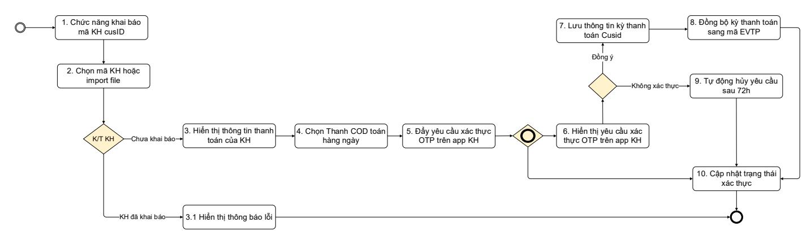
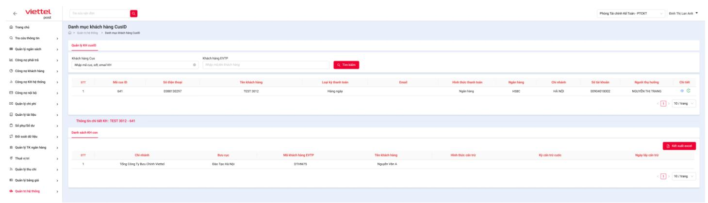
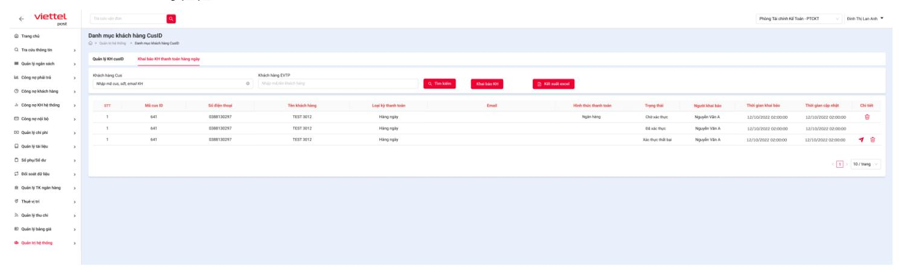
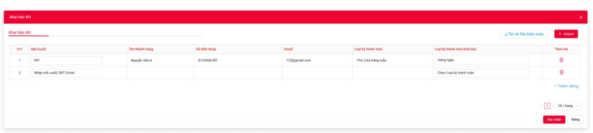
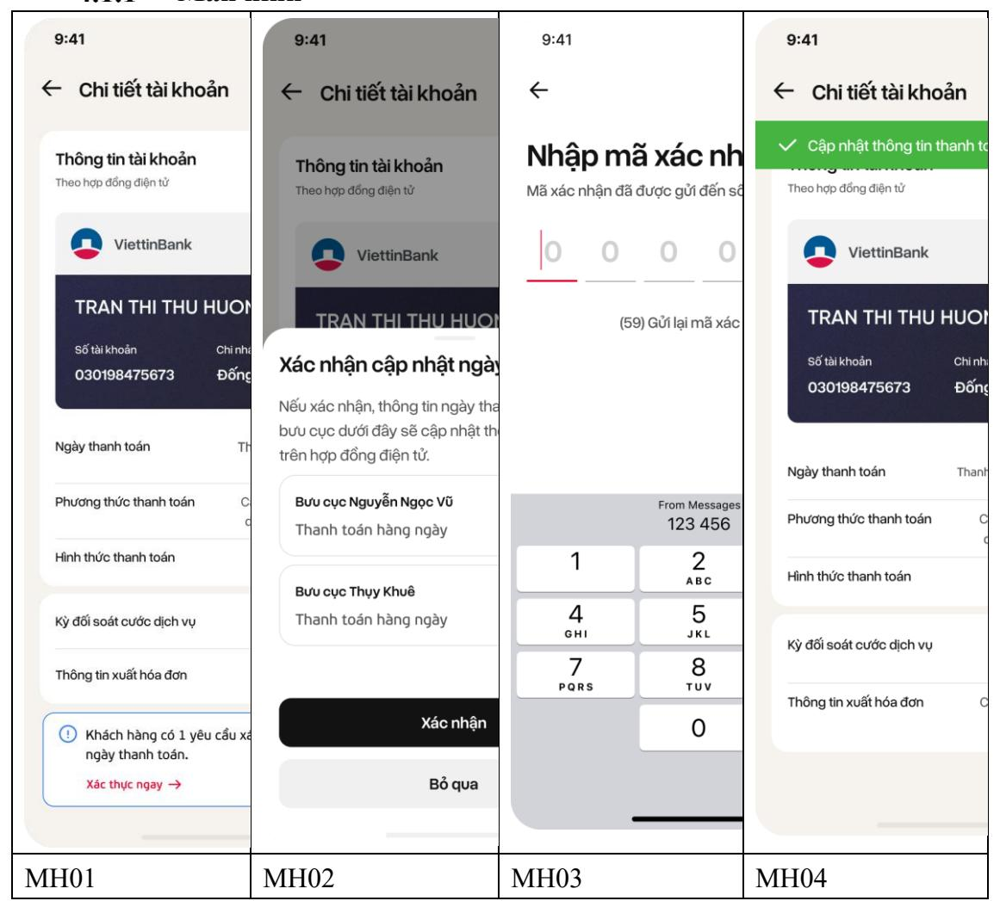

# 1. Tổng quan
## 1.1 Mục đích
Tài liệu trình bày tổng quan giải pháp và quy trình nghiệp vụ đáp ứng cho bài toán tích hợp đối tác kinh doanh tại Tổng công ty cổ phần Bưu chính Viettel.

Thiết kế, mô tả các quy trình nghiệp vụ của Hệ thống đảm bảo cung cấp giải pháp hoàn chỉnh, xuyên suốt quá trình khai báo và phê duyệt mã KH chi COD

## 1.2 Phạm vi
| STT | Nghiệp vụ                                 | Phạm vi áp dụng                                                                                                                                                                                                                                                                                    |  |  |
|-----|-------------------------------------------|----------------------------------------------------------------------------------------------------------------------------------------------------------------------------------------------------------------------------------------------------------------------------------------------------|--|--|
| 1.  | Khai báo cấu hình                         | - Khai báo cấu hình sản lượng doanh thu theo địa bàn - Khai báo mã KH cấu hình chi COD                                                                                                                                                                                                 |  |  |
| 2.  | Phê duyệt mã KH                           | Thực hiện phê duyệt mã KH đã khai báo theo sản lượng/doanh thu cam kết - Hệ thống tự động phê duyệt nếu đạt sản lượng hoặc doanh thu theo địa bàn - Hệ thống thự hiện trình ký phê duyệt Voffice với các trường hợp không đạt doanh thu sản lượng theo địa bàn |  |  |
| 3.  | Báo cáo sản lượng doanh thu theo mã KH | Báo cáo cấu hình chi của mã KH Báo cáo sản lượng/doanh thu                                                                                                                                                                                                                                      |  |  |

# 2. Quy trình tổng quan

#### Mô tả quy trình:

| Bước | Nội dung                                            | Đối tượng thực hiện  | Hệ thống thực hiện | Mô tả                                                                                                                                                                                                                                                                                     |
|------|-----------------------------------------------------|-------------------------|-----------------------|-------------------------------------------------------------------------------------------------------------------------------------------------------------------------------------------------------------------------------------------------------------------------------------------|
| 1    | Chức năng khai báo mã KH cusID                   | User được phân quyền | FICO                  | User được phân quyền truy cập vào chức năng khai báo mã KH cusID trên hệ thống FICO. Chuyển bước 2.                                                                                                                                                                                       |
| 2    | Chọn mã KH hoặc Import file                      | ·   Dhan   FICC)        |                       | <ul> <li>Người dùng nhập mã KH hoặc import danh sách KH cần khai báo chi COD hàng ngày.</li> <li>Hệ thống kiếm tra: <ul> <li>Nếu KH đang có kỳ thanh toán COD hàng ngày → Thông báo lỗi</li> <li>Nếu KH đang không có kỳ thanh toán COD hàng ngày → chuyển bước 3.</li> </ul> </li> </ul> |
| 3    | Hiển thị thông tin thanh toán của KH          | Hệ thống                | FICO                  | Hiển thị thông tin thanh toán hiện tại của cus tìm kiếm. Chuyển bước 4.                                                                                                                                                                                                                |
| 4    | Chọn Thanh toán COD hàng ngày                    | User được phân quyền | FICO                  | Chọn loại kỳ thanh toán Hàng ngày cho các mã KH khai báo. Chuyển bước 5.                                                                                                                                                                                                                  |
| 5    | Xác nhận đẩy yêu cầu xác thực OTP trên app KH | User được phân quyền | FICO                  | Người dùng xác nhận khai báo các mã KH về hình thức thanh toán COD hàng ngày. Hệ thống tự động đẩy yêu cầu xác thực OTP lên app KH. Chuyển bước 6.                                                                                                                                        |
| 6    | Hiển thị yêu cầu xác thực lên app KH          | Hệ thống                | Арр КН                | <ul> <li>KH thực hiện xác thực OTP trên App KH.</li> <li>- Xác thực thành công → chuyển bước 7</li> <li>- Không xác thực → Chuyển bước 9</li> </ul>                                                                                                                                       |
| 7    | Lưu thông tin kỳ thanh toán cusID                 | Hệ thống                                                                                 | FICO                     | KH xác thực thành công → hệ thống tự động cập nhật thông tin thanh toán mới của KH. - Hiển thị Ngày thanh toán mới và lịch sử cập nhật trên app KH - Cập nhật thông tin kỳ thanh toán trên hệ thống FICO, HR → Chuyển bước 8.                                                                  |
| 8    | Đồng bộ kỳ thanh toán sang mã EVTP | Đồng bộ kỳ thanh toán từ EVTP thuộc cus. Hệ thống FICO Chuyển bước 10. |                          | mã Cus sang toàn bộ mã                                                                                                                                                                                                                                                                                                                   |
| 9    | Tự động hủy yêu cầu sau 72h                    | Hệ thống                                                                                 | FICO                     | Với yêu cầu xác thực quá 72h không có phản hồi từ KH → hệ thống tự động cập nhật về trạng thái Xác thực thất bại. Khi KH click vào yêu cầu trên app → - hệ thống thông báo Yêu cầu không tồn tại hoặc đã quá hạn xử lý - Hệ thống cập nhật trạng thái Xác thực thất bại. Chuyển bước 10. |
| 10   | Cập nhật trạng thái xác thực                | Hệ thống                                                                                 | FICO                     | Hệ thống cập nhật chính xác trạng thái xác thực. Kết thúc luồng.                                                                                                                                                                                                                                                                      |

# 3. Chi tiết chức năng Quản lý CusID và khai báo KH thanh toán hàng ngày trên FICO

## 3.1 SCR1: Màn hình Quản lý khách hàng CusID

### 3.1.1 Màn hình

Phân quyền: User được phân quyền theo quy định của TTDVCP

### 3.1.2 Mô tả màn hình

| -   | 3.1.2 Mio ta man mini |                 |                       |                            |                                                                                                                                                                                                                                      |  |  |  |
|-----|-----------------------|-----------------|-----------------------|----------------------------|--------------------------------------------------------------------------------------------------------------------------------------------------------------------------------------------------------------------------------------|--|--|--|
| No  | Field Name         | Control Type | Mandatory (Yes/No) | Editable/ Read- only | Description/Note                                                                                                                                                                                                                     |  |  |  |
| Chú | Chức năng tra cứu     |                 |                       |                            |                                                                                                                                                                                                                                      |  |  |  |
| 1   | Khách hàng cus     | Textbox         | No                    | Editable                   | Cho phép user nhập thông tin KH để tìm kiếm. Cho phép nhập các giá trị sau:  - Mã CusID  - Số điện thoại (sđt đăng nhập hệ thống app/web)  - Email (Email đăng nhập hệ thống app/web)  Hệ thống tìm kiếm mã cus theo điều kiện nhập. |  |  |  |
| 2   | Khách hàng EVTP    | Textbox         | No                    | Editable                   | Cho phép KH nhập mã EVTP để tìm kiếm mã KH CusID                                                                                                                                                                                     |  |  |  |
| 3   | Tìm kiếm              | Button          | Yes                   | Editable                   | Click button thực hiện tra cứu. Hiển thị toàn bộ dữ liệu theo điều kiện tìm kiếm                                                                                                                                               |  |  |  |
| Chi | Chi tiết thông tin KH |                 |                       |                            |                                                                                                                                                                                                                                      |  |  |  |
| 4  | STT                                                                        | Text            | No                    | Read- only              | Hiển thị số thứ tự                                                                                                                                                                                                                                          |  |  |
| 5  | Mã cusid                                                                   | Text            | No                    | Editable                   | Hiển thị mã Cusid                                                                                                                                                                                                                                           |  |  |
| 6  | Số điện thoại                                                           | Text            | No                    | Read- only              | Hiển thị số điện thoại KH                                                                                                                                                                                                                                   |  |  |
| 7  | Tên KH                                                                     | Text            | No                    | Read- only              | Hiển thị Tên KH                                                                                                                                                                                                                                             |  |  |
| 8  | Loại kỳ thanh toán                                                      | Text            | No                    | Read- only              | Hiển thị loại kỳ thanh toán theo HDDT                                                                                                                                                                                                                    |  |  |
| 9  | Email                                                                      | Text            | No                    | Read- only              | Hiển thị email KH                                                                                                                                                                                                                                           |  |  |
| 10 | Hình thức thanh toán                                                    | Text            | No                    | Read- only              | Hiện thị hình thức thanh toán của KH                                                                                                                                                                                                                        |  |  |
| 11 | Ngân hàng                                                                  | Text            | No                    | Read- only              | Hiển thị ngân hàng nhận COD theo HDDT                                                                                                                                                                                                                    |  |  |
| 12 | Chi nhánh                                                                  | Text            | No                    | Read- only              | Hiển thị chi nhánh của ngân hàng Không có để trống                                                                                                                                                                                                       |  |  |
| 13 | Số tài khoản                                                            | Text            | No                    | Read- only              | Hiển thị số tài khoản theo HDDT                                                                                                                                                                                                                             |  |  |
| 14 | Người thụ hưởng                                                         | Text            | No                    | Read- only              | Hiển thị tên người thụ hưởng theo HDDT                                                                                                                                                                                                                   |  |  |
| 15 | Thao tác                                                                   | Button          | Yes                   | Editable                   | Cho phép thao tác sửa và xóa cấu hình theo từng địa bàn.  - Click Button Xem → cho phép xem chi tiết danh sách KH EVTP của mã cus  - Click Xem lịch sử → Hiển thị lịch sử cập nhật của cusid.  Hiển thị tooltip khi Hower chuột "Xem" và "Lịch sử cập nhật" |  |  |
| 9  | Chi tiết thông tin KH EVTP Hiển thị danh sách mã KH EVTP thuộc mã CusID |                 |                       |                            |                                                                                                                                                                                                                                                             |  |  |
| 1  | STT                                                                        | Text            | No                    | Read- only              | Hiển thị số thứ tự                                                                                                                                                                                                                                          |  |  |
| 2  | Chi nhánh            | Text            | No                    | Read- only              | Hiển thị tên chi nhánh                                                                                                                                                                                                                                                                                                                                                          |
| 3  | Bưu cục              | Text            | No                    | Read- only              | Hiển thị tên bưu cục                                                                                                                                                                                                                                                                                                                                                            |
| 4  | Mã KH EVTP        | Text            | No                    | Read- only              | Hiển thị mã KH EVTP                                                                                                                                                                                                                                                                                                                                                             |
| 5  | Tên KH               | Text            | No                    | Read- only              | Hiển thị tên KH EVTP                                                                                                                                                                                                                                                                                                                                                            |
| 6  | Hình thức cấn trừ | Text            | No                    | Read- only              | Hiển thị hình thức cấn trừ của mã EVTP Không có để trống.                                                                                                                                                                                                                                                                                                                 |
| 7  | Kỳ cấn trừ           | Text            | No                    | Read- only              | Hiển thị kỳ cấn trừ. Không có để trống.                                                                                                                                                                                                                                                                                                                                      |
| 8  | Ngày lấy cấn trừ  | Text            | No                    | Read- only              | Hiển thị ngày lấy cấn trừ Không có để trống.                                                                                                                                                                                                                                                                                                                                 |
| 9  | Kết xuất excel    | Button          | Yes                   | Editable                   | <ul> <li>Khi click thì thực hiện kết xuất danh sách excel trên grid.</li> <li>Quy Tắc Kết Xuất:</li> <li>Nếu kết quả tìm kiếm không có dữ liệu thì hệ thống hiển thị thông báo "Không tồn tại kết quả".</li> <li>Nếu kết quả tìm kiếm có dữ liệu thì hệ thống thực hiện kết xuất toán bộ dữ liệu trên grid.</li> <li>Tên file: Danh sách KH EVTP mã cusID {Mã cusid}</li> </ul> |

## 3.2 SCR2: Màn hình Khai báo mã khách hàng

### 3.2.1 Màn hình

### 3.2.2 Mô tả Màn hình

|      |                    |                 |                       | ·                      |                                                                                                                                                                                                                                      |  |  |  |
|------|--------------------|-----------------|-----------------------|------------------------|--------------------------------------------------------------------------------------------------------------------------------------------------------------------------------------------------------------------------------------|--|--|--|
| No   | Field Name         | Control Type | Mandatory (Yes/No) | Editable/ Read-only | Description/Note                                                                                                                                                                                                                     |  |  |  |
| Chức | Chức năng tra cứu  |                 |                       |                        |                                                                                                                                                                                                                                      |  |  |  |
| 1    | Khách hàng cus     | Textbox         | No                    | Editable               | Cho phép user nhập thông tin KH để tìm kiếm. Cho phép nhập các giá trị sau:  - Mã CusID  - Số điện thoại (sđt đăng nhập hệ thống app/web)  - Email (Email đăng nhập hệ thống app/web)  Hệ thống tìm kiếm mã cus theo điều kiện nhập. |  |  |  |
| 2    | Khách hàng EVTP | Textbox         | No                    | Editable               | Cho phép KH nhập mã EVTP để tìm kiếm mã KH CusID                                                                                                                                                                                     |  |  |  |
| 3    | Tìm kiếm           | Button          | Yes                   | Editable               | Click button thực hiện tra cứu. Hiển thị toàn bộ dữ liệu theo điều kiện tìm kiếm                                                                                                                                               |  |  |  |
| 4  | Kết xuất excel              | Button          | Yes                   | Editable               | Khi click thì thực hiện kết xuất danh sách excel trên grid. Quy Tắc Kết Xuất: ❖ Nếu kết quả tìm kiếm không có dữ liệu thì hệ thống hiển thị thông báo "Không tồn tại kết quả". ❖ Nếu kết quả tìm kiếm có dữ liệu thì hệ thống thực hiện kết xuất toán bộ dữ liệu trên grid. ➢ Tên file: Danh sách KH khai báo thanh toán hàng ngày |
| 5  | Khai báo mã KH              | Button          | Yes                   | Editable               | Hiển thị button Khai báo mã KH. Click button hiển thị popup Khai báo mã KH chi tiết tại màn hình SCR 3. Màn hình Khai báo thông tin mã KH                                                                                                                                                                                                                                       |
|    | Chi tiết thông tin cấu hình |                 |                       |                        |                                                                                                                                                                                                                                                                                                                                                                                                |
| 6  | STT                         | Text            | No                    | Read-only              | Hiển thị số thứ tự                                                                                                                                                                                                                                                                                                                                                                    |
| 7  | STT                         | Text            | No                    | Read-only              | Hiển thị số thứ tự                                                                                                                                                                                                                                                                                                                                                                    |
| 8  | Mã cusid                    | Text            | No                    | Editable               | Hiển thị mã Cusid                                                                                                                                                                                                                                                                                                                                                                           |
| 9  | Số điện thoại            | Text            | No                    | Read-only              | Hiển thị số điện thoại KH                                                                                                                                                                                                                                                                                                                                                                |
| 10 | Tên KH                      | Text            | No                    | Read-only              | Hiển thị Tên KH                                                                                                                                                                                                                                                                                                                                                                             |
| 11 | Loại kỳ thanh toán    | Text            | No                    | Read-only              | Hiển thị loại kỳ thanh toán theo HDDT                                                                                                                                                                                                                                                                                                                                                    |
| 12 | Email                       | Text            | No                    | Read-only              | Hiển thị email KH                                                                                                                                                                                                                                                                                                                                                                           |
| 13 | Hình thức thanh toán     | Text            | No                    | Read-only              | Hiện thị hình thức thanh toán của KH                                                                                                                                                                                                                                                                                                                                                        |
| 14 | Trạng thái            | Text            | No                    | Read-only              | Hiển thị trạng thái tương ứng của yêu cầu: - Chờ xác thực – Đã gửi yêu cầu xác thực nhưng KH chưa xác thực - Đã xác thực – KH đã xác thực OTP thành công - Xác thực thất bại – KH từ chối xác thực hoặc xác thực tự động hủy sau 72h - Không hoạt động – khi có cập nhật kỳ thanh toán mới (KH ký PL HĐ có thay đổi kỳ thanh toán hoặc thay đổi kỳ thanh toán) |
| 15 | Người khai báo        | Datetime        | No                    | Read-only              | Hiển thị tên người thực hiện khai báo                                                                                                                                                                                                                                                                                                                                                                                                        |
| 16 | Thời gian khai báo | Datetime        | No                    | Read-only              | Hiển thị thời gian thực hiện khai báo                                                                                                                                                                                                                                                                                                                                                                                                        |
| 17 | Thời gian cập nhật | Datetime        | No                    | Read-only              | Hiển thị thời gian cập nhật (thời gian xác thực, hủy)                                                                                                                                                                                                                                                                                                                                                                                     |
| 18 | Thao tác              | Button          | Yes                   | Editable               | Cho phép thao tác gửi lại yêu cầu xác thực và xóa cấu hình. Click Button Gửi yêu cầu xác thực → - chỉ hiển thị với trạng thái Xác thực thất bại và Không hoạt động. - Click Xóa →Chỉ hiển thị với trạng thái Chờ xác thực và Xác thực thất bại Hiển thị thông báo Xác nhận xóa khai báo cấu hình. Hiển thị tooltip khi Hower chuột "Gửi yêu cầu xác thực" và "Xóa"                        |

#### SCR3. Màn hình Khai báo thông tin mã KH

| No | Field Name                 | Control Type | Mandatory (Yes/No) | Editable/ Read-only | Description/Note                                                                                                                                                                                                                                                                                                                                                                                                                                                                                                                                                                                                                                                                |
|----|----------------------------|-----------------|-----------------------|------------------------|---------------------------------------------------------------------------------------------------------------------------------------------------------------------------------------------------------------------------------------------------------------------------------------------------------------------------------------------------------------------------------------------------------------------------------------------------------------------------------------------------------------------------------------------------------------------------------------------------------------------------------------------------------------------------------|
| 1  | Import file                | Button          | Yes                   | Editable               | Cho phép user import file KH theo template. Nguyên tắc import: - Nếu KH đang có khai báo kỳ thanh toán COD hàng ngày → không cho phép import - Nếu KH đang không phải kỳ thanh toán hàng ngày → cho phép import - Dữ liệu import lên phải là mã cusid                                                                                                                                                                                                                                                                                                                                                                              |
| 2  | Tải xuống file biểu mẫu | Button          | No                    | Editable               | Cho phép user tải xuống file biểu mẫu Template file:                                                                                                                                                                                                                                                                                                                                                                                                                                                                                                                                                                                                                         |
| 3  | STT                        | Button          | Yes                   | Editable               | Hiển thị STT                                                                                                                                                                                                                                                                                                                                                                                                                                                                                                                                                                                                                                                                 |
| 4  | Mã CusID                   | Texbox          | Yes                   | Editable               | Cho phép user nhập thông tin KH để tìm kiếm. Cho phép nhập các giá trị sau: - Mã CusID - Số điện thoại (sđt đăng nhập hệ thống app/web) - Email (Email đăng nhập hệ thống app/web) Click enter hoặc click chuột → Hệ thống tìm kiếm mã cus theo điều kiện nhập. Kiểm tra mã cus nhập vào hệ thống: - Nếu KH đang có khai báo kỳ thanh toán COD hàng ngày → Thông báo lỗi "KH đang có kỳ thanh toán hàng ngày" - Nếu KH đang không phải kỳ thanh toán hàng ngày → Hiển thị thông tin KH tìm kiếm - Mã KH nhập bị trùng với mã KH đã nhập → báo lỗi "Mã KH đã được nhập" |
| 5  | Tên KH                     | Text            | N/A                   | Readonly               | Hiển thị tên KH theo cus đã tìm kiếm Không có để trống                                                                                                                                                                                                                                                                                                                                                                                                                                                                                                                                                                                                                 |
| 6  | Số điện thoại                  | Text            | N/A                   | Readonly               | Hiển thị SĐT KH theo cus đã tìm kiếm Không có để trống                                                                     |
| 7  | Email                          | Text            | N/A                   | Readonly               | Hiển thị Email KH theo cus đã tìm kiếm Không có để trống                                                                   |
| 8  | Loại kỳ thanh toán          | Text            | N/A                   | Readonly               | Hiển thị loại kỳ thanh toán đang áp dụng theo cus đã tìm kiếm Không có để trống                                         |
| 9  | Loại kỳ thanh toán khai báo | Dropdownlist    | Yes                   | Editable               | Cho phép chọn loại kỳ thanh toán Mặc định chọn: Hàng ngày                                                                  |
| 10 | Thao tác                       | Button          | Yes                   | Editable               | Cho phép thao tác xóa mã KH đã nhập Click Xóa → Hiển thị thông báo Xác nhận xóa mã KH. Hiển thị tooltip khi Hower chuột "Xóa" |
| 11 | Xác nhận                       | Button          | Yes                   | Editable               | Click Cập nhật để gửi yêu cầu xác thực → đẩy yêu cầu xác thực sang hệ thống App KH                                      |
| 12 | Đóng                           | Button          | Yes                   | Editable               | Click "Đóng" để tắt nội dung thay đổi                                                                                         |
| 13 | Thêm dòng                      | Button          | Yes                   | Editable               | Cho phép user thêm dòng để nhập mã KH khai báo                                                                             |

## 3.3 Yêu cầu nghiệp vụ chi tiết

KH được xác thực thanh công sẽ có Kỳ thanh toán hàng ngày → hệ thống tự động cập nhật toàn bộ mã KH EVTP của mã CusID về kỳ thanh toán của cus

Kỳ thanh toán sẽ thay đổi nếu KH thực hiện Ký PL thay đổi hình thức thanh toán hoặc thực hiện yêu cầu xác thực lại Kỳ thanh toán → Kỳ thanh toán đã được khai báo sẽ được cập nhật về trạng thái Không hoạt động.

#### Ånh hưởng:

- Màn hình quản lý KH chi nhánh trên HR thêm type "Thanh toán COD hàng ngày"
- Màn hình quản lý KH FICO thêm type "Thanh toán COD hàng ngày"
- Chức năng chi: hệ thống gom chi tự động theo đúng hình thức thanh toán của KH

# 4. Chi tiết chức năng Xác thực OTP trên app KH

## 4.1 SCR1: Màn hình yêu cầu xác thực

#### Màn hình

#### Mô tả màn hình
- Hiển thị thông báo "Khách hàng có 1 yêu cầu xác thực thay đổi ngày thanh toán COD. Xác thực ngay." → click thông báo hiển thị màn hình MH02: Xác nhận cập nhật ngày thanh toán → click Xác nhận → hiển thị màn hình MH03: nhập mã xác thực OTP → Xác thực thành công hiển thị màn hình MH04: thông báo cập nhật thành công,
- MH01: Chi tiết tài khoản → Hiển thị cảnh báo "Khách hàng có 1 yêu cầu xác thực thay đổi ngày thanh toán COD. Xác thực ngay." → Click Xác thực ngay → Chuyển sang màn MH02.
- MH02: Xác nhận cập nhật ngày thanh toán.
  - Hiển thị thông tin cập nhật
  - Click Xác nhận → chuyển màn hình MH03
  - Click Bỏ qua để từ chối cập nhật → Cập nhật trạng thái "Xác nhận thất bại" với lý do "KH từ chối xác nhận."

- MH03: Xác thực OTP
  - KH nhập mã xác thực qua tin nhắn gửi về.
  - Xác thực thành công → chuyển màn hình MH04
  - Xác thực không thành công → quay về màn hình MH01.

MH04: Thông báo thành công → Hiển thị thông báo "Cập nhật thông tin thanh toán thành công" nếu KH xác thực OTP thành công
